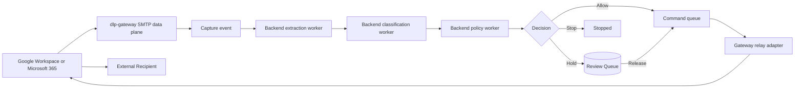
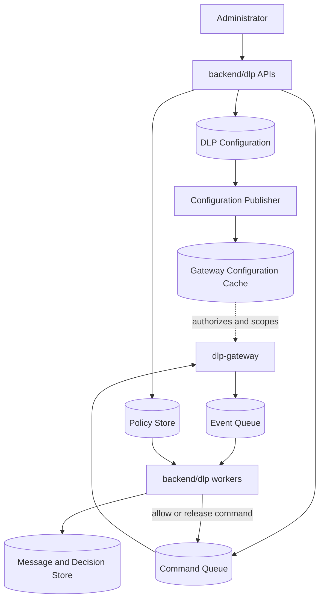
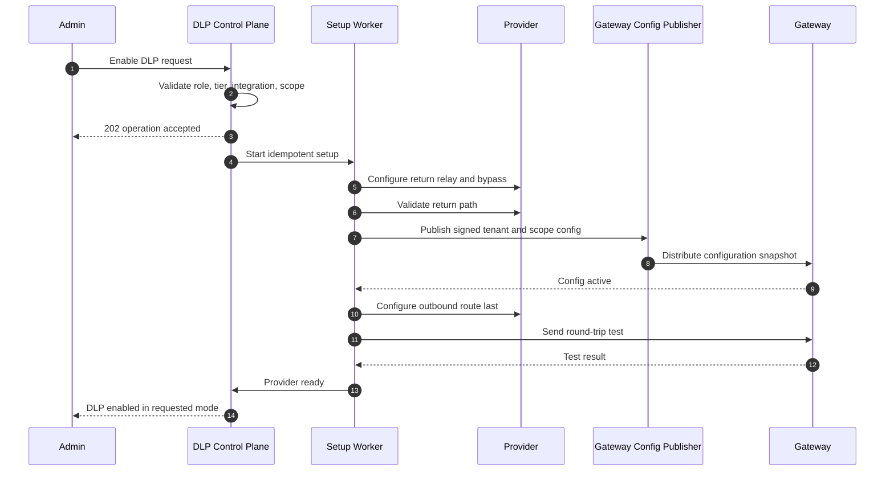

# DLP Backend Implementation Roadmap

## Purpose

This document describes how to build the DLP **backend control plane and application workers** that integrate with the separate SMTP gateway defined in `docs/DLP_INGRESS_GATEWAY_PLAN.md`.

It covers:

- Repository layout for `dlp-gateway/` vs `backend/dlp/`.
- Tenant enablement and the **Enable DLP** administrator action.
- All-user and selected-user protection scopes.
- Provider setup orchestration for Microsoft 365 and Google Workspace.
- Gateway/control-plane integration contracts.
- Message extraction, classification, and policy evaluation.
- Allow, hold, release, and stop enforcement orchestration.
- Queue, logs, overview statistics, settings, and engine health APIs.
- Notifications, auditability, observability, testing, migration, and rollout.

## Product outcome

An authorized administrator can:

1. Open DLP settings.
2. Choose **Enable DLP**.
3. Select:
   - All users; or
   - Specific users.
4. Select monitor mode or enforcement mode.
5. Review provider prerequisites and affected mailboxes.
6. Start asynchronous setup.
7. See provider-by-provider progress.
8. Enable enforcement only after the gateway route, return relay, loop prevention, and deliverability checks pass.

Once enabled, protected outbound messages follow:



## Core architectural decisions

### 1. Two deployable units

Build DLP as **two deployable units** in the monorepo:

1. `dlp-gateway/` — SMTP data plane (accept, spool, capture, relay).
2. `backend/dlp/` — control plane APIs and application workers (enablement, classification, policy, review, setup, notifications).

Do not add production DLP behavior to the current overlapping legacy paths under `backend/services/dlp_*.py` or `infra/dlp/dlp_gateway.py`.

#### Repository layout

```text
himaya-prod-azure/
├── dlp-gateway/                      # Separate SMTP data-plane service
│   ├── Dockerfile
│   ├── requirements.txt
│   ├── conf/
│   │   └── postfix/
│   ├── scripts/
│   ├── app/
│   │   ├── main.py                   # Gateway process bootstrap
│   │   ├── config.py
│   │   ├── smtp/
│   │   │   ├── edge.py
│   │   │   ├── trust.py
│   │   │   ├── tenant_resolver.py
│   │   │   └── headers.py
│   │   ├── spool/
│   │   │   ├── mta_spool.py
│   │   │   └── recovery.py
│   │   ├── capture/
│   │   │   ├── worker.py            # Spool → immutable MIME + metadata
│   │   │   └── mime_store.py
│   │   ├── config_cache/
│   │   │   ├── snapshot.py           # Signed tenant config cache
│   │   │   └── refresh.py
│   │   ├── relay/
│   │   │   ├── dispatcher.py
│   │   │   ├── egress_copy.py
│   │   │   ├── outcomes.py
│   │   │   └── adapters/
│   │   │       ├── base.py
│   │   │       ├── microsoft.py
│   │   │       └── google.py
│   │   ├── commands/
│   │   │   ├── consumer.py           # release / stop / retry
│   │   │   └── processor.py
│   │   ├── events/
│   │   │   └── publisher.py          # dlp.message.captured.v1, etc.
│   │   ├── health/
│   │   └── metrics/
│   └── tests/
│
├── backend/
│   ├── main.py                       # Mounts /api/dlp/v2
│   ├── routers/                      # Legacy DLP routes — retire later
│   ├── services/                     # Shared QueueClient, StorageClient, email
│   └── dlp/                          # DLP control plane + app workers
│       ├── api/
│       │   ├── router.py
│       │   ├── enablement.py
│       │   ├── policies.py
│       │   ├── queue.py
│       │   ├── logs.py
│       │   ├── overview.py
│       │   ├── settings.py
│       │   ├── eligible_users.py
│       │   └── schemas.py
│       ├── application/
│       │   ├── enablement_service.py
│       │   ├── setup_service.py
│       │   ├── scope_service.py
│       │   ├── message_orchestrator.py
│       │   ├── review_service.py
│       │   ├── policy_service.py
│       │   └── config_publisher.py
│       ├── domain/
│       ├── classification/
│       │   ├── engine.py
│       │   ├── registry.py
│       │   ├── extractors/
│       │   └── detectors/
│       ├── policy/
│       │   ├── evaluator.py
│       │   ├── compiler.py
│       │   └── simulator.py
│       ├── providers/                # Provider setup automation, not SMTP
│       │   ├── base.py
│       │   ├── microsoft.py
│       │   └── google.py
│       ├── persistence/
│       ├── contracts/                # Shared schemas with dlp-gateway
│       │   ├── events.py
│       │   ├── commands.py
│       │   └── config_snapshot.py
│       └── workers/
│           ├── capture_consumer.py   # Consumes gateway capture events
│           ├── classify.py
│           ├── evaluate.py
│           ├── setup.py
│           ├── reconcile.py
│           └── notify.py
│
└── infra/dlp/                        # Legacy gateway scripts — do not extend
```

#### Ownership by folder

| Concern | Location | Deployed as |
| --- | --- | --- |
| SMTP accept, spool, MIME capture, provider return relay | `dlp-gateway/` | Separate VM/AKS pods with Postfix |
| Enable DLP APIs, policies, review, settings, overview | `backend/dlp/api/` | Existing FastAPI service |
| Classification, policy evaluation, setup, notify, reconcile | `backend/dlp/workers/` | Same app or worker pool |
| Provider admin setup (connectors, groups, routing rules) | `backend/dlp/providers/` | Backend workers |
| Event/command/config contracts | `backend/dlp/contracts/` (+ imported by gateway) | Shared schemas |
| Shared Azure clients | `backend/services/` | Reused or mirrored by gateway |

Exact file names may change. The two-service boundary must not.

### 2. One orchestration path

Every gateway message must use the same lifecycle:

```text
captured by dlp-gateway
  -> extracted
  -> classified
  -> evaluated
  -> allowed | held | stopped
  -> relayed by dlp-gateway
  -> provider_accepted | failed | outcome_uncertain
```

Do not maintain separate webhook, inline polling, draft, and gateway policy engines.

### 3. Separate control plane and data plane

**SMTP data plane (`dlp-gateway/`)** owns:

- SMTP acceptance and trust checks.
- Durable MTA spool before `250`.
- Immutable MIME capture to object storage.
- Local signed configuration cache.
- Provider return relay and delivery outcomes.
- Consuming release/stop/retry commands.
- Publishing capture and delivery events.

**Control plane + application workers (`backend/dlp/`)** own:

- Administrator APIs.
- DLP enablement configuration.
- User scope.
- Policies.
- Setup validation.
- Review authorization.
- Settings and status.

**Backend application workers** (not the SMTP edge) own:

- Content extraction from stored MIME.
- Classification execution.
- Policy evaluation.
- Setup/repair orchestration.
- Notifications.
- Delivery reconciliation using provider traces.

They communicate only through durable commands, events, and signed configuration snapshots. The SMTP edge must never call FastAPI synchronously during mail acceptance.



### 4. DLP scope is independent from monitoring scope

The existing `OrgIntegration.scope_group_id` controls directory/threat-monitoring scope. It must not become the source of truth for DLP.

Otherwise, selecting DLP users could unexpectedly deactivate monitoring for other users.

Create dedicated DLP scope records. Existing directory users and groups can be referenced, but their monitoring state must not be modified by DLP enablement.

### 5. Asynchronous setup

**Enable DLP** must start an idempotent setup operation and return `202 Accepted`.

It must not:

- Immediately set `dlp_enabled=true`.
- Claim success before provider routing is verified.
- Enable blocking before a round-trip test passes.
- Partially configure a provider without exposing that state.

## Integration with the existing repository

### Reuse

Reuse these existing foundations where appropriate:

- `Organization`, `User`, `EmailGroup`, and `OrgIntegration` from `backend/models/db_models.py`.
- Directory synchronization helpers in `backend/services/baseline_ingestion.py` and `backend/services/delta_sync.py`.
- `QueueClient` from `backend/services/queue_client.py`.
- `StorageClient` from `backend/services/storage_client.py`.
- `send_email()` from `backend/services/email_service.py`.
- JWT authentication through `get_current_user()` in `backend/routers/auth.py`.
- Existing provider tokens and integration status in `OrgIntegration`.

### Replace or retire

Do not extend these as the production gateway or DLP v2 path:

- `infra/dlp/dlp_gateway.py` synchronous reject-based milter.
- `backend/routers/dlp_webhook.py` HTTP-status enforcement.
- Post-send enforcement in `backend/services/dlp_inline.py`.
- Split pipeline in `backend/services/dlp_service.py`.
- MIME reconstruction in `dlp_service.release_email()`.
- Mock provider policy push as the source of enforcement truth.
- Organization-level ad hoc `dlp_*` columns as the long-term configuration model.

These can remain temporarily behind legacy feature flags during migration. New work goes into `dlp-gateway/` and `backend/dlp/`.

## Enable DLP capability

### Administrator experience

The UI can display one primary action:

```text
Enable DLP
```

The button opens an enablement wizard backed by control-plane APIs.

Required steps:

1. Select provider integrations.
2. Select protection scope:
   - All users.
   - Specific users.
3. Select initial mode:
   - Monitor.
   - Enforce.
4. Review prerequisites and affected mailboxes.
5. Confirm setup.
6. Follow asynchronous provider setup and validation.

For safety, the recommended default is `monitor`. An administrator can switch to `enforce` after observing classifications and validating policies.

### Authorization

Only the following roles should manage DLP enablement:

- `owner`
- `admin`
- `superadmin`
- `super_admin`

Enterprise tier validation remains required.

Analysts may review held messages if granted a separate DLP reviewer permission, but they must not change provider routing or organization-wide enablement.

Add explicit permission checks instead of relying only on `_require_enterprise()`.

Suggested permissions:

```text
dlp.enable
dlp.disable
dlp.configure
dlp.policy.manage
dlp.review
dlp.release
dlp.logs.read
dlp.settings.read
```

Roles can initially map to these permissions in code and later move to a formal RBAC table.

### Scope model

#### All users

Semantics:

- Every active mailbox in the selected provider integration is protected.
- Newly synchronized users become protected automatically.
- Aliases and shared mailboxes follow provider-specific eligibility rules.
- Provider routing should dynamically cover the tenant or provider-side DLP group.

#### Specific users

Semantics:

- Only explicitly selected directory user IDs are protected.
- Store stable internal user IDs and provider directory IDs, not only email strings.
- Email changes do not silently remove protection.
- Deleted or inactive users become unresolved scope targets and generate configuration warnings.

#### Future scope types

Design the schema so it can later support:

- Directory groups.
- Departments.
- Organizational units.
- Shared mailboxes.
- Exclusions.

Do not expose these until provider behavior is tested.

### Provider translation of selected users

The control plane stores a provider-neutral scope. Each provider adapter translates it into enforceable routing configuration.

#### Microsoft 365

Preferred approach:

- Create or manage a tenant-side mail-enabled security group for Himaya-protected users.
- Scope the Exchange transport rule to senders in that group.
- Keep group membership synchronized from the DLP target table.

For a small POC, explicit sender conditions may be used, but they should not be the production scaling model.

#### Google Workspace

Preferred approach:

- Use a Google configuration group or organizational-unit routing scope where supported.
- Keep selected-user membership synchronized.
- Validate that returned SMTP-relay messages bypass the outbound rule.

Google selected-user routing must pass the same tenant readiness gate as all-user routing. If the tenant's Google edition or configuration cannot express the requested scope safely, setup must fail with a clear prerequisite rather than enabling broader coverage.

#### Defense in depth

The gateway configuration snapshot includes the protected sender set or a compiled scope representation.

If an out-of-scope sender reaches the gateway because provider configuration is stale:

1. Do not classify or hold it under DLP policies.
2. Relay it safely through the provider-return path.
3. Record a `scope_mismatch` operational event.
4. Trigger provider configuration reconciliation.

This avoids accidentally blocking an unprotected user because of configuration drift.

### Enablement state model

Organization status and provider status must be separate.

#### Organization status

```text
disabled
configuring
partially_ready
ready
enabled_monitor
enabled_enforce
degraded
disabling
failed
```

#### Provider deployment status

```text
not_configured
validating_prerequisites
configuring_return_path
validating_return_path
publishing_gateway_config
configuring_outbound_route
testing_round_trip
ready
enabled
degraded
failed
disabled
```

#### Why separate statuses matter

An organization may have:

- Microsoft ready and Google failed.
- One provider in monitor and another disabled.
- A provider degraded while the other remains healthy.

The backend must not return a single misleading `enabled=true`.

### Safe enablement ordering

Provider setup order must prevent loops and blackholes.



The outbound route is configured last. This prevents the provider from sending production mail to a gateway that cannot return it.

### Safe disablement ordering

Disable in reverse:

1. Disable or remove provider outbound routing first.
2. Stop accepting new messages for the deployment after route propagation.
3. Keep return connector, certificates, and gateway configuration active.
4. Drain allowed and released messages.
5. Resolve or explicitly retain held messages.
6. Reconcile uncertain outcomes.
7. Remove provider return configuration only after queues are empty.
8. Revoke gateway configuration and certificates last.

An administrator must choose what happens to existing held messages:

- Keep held until reviewed.
- Stop all.
- Release all after explicit confirmation.

Never implicitly release held messages during disablement.

### Safe scope-change ordering

#### Expanding selected users

1. Add targets in pending state.
2. Publish expanded gateway scope.
3. Update provider-side group/routing scope.
4. Validate new users.
5. Mark targets active.

#### Removing selected users

1. Remove users from provider-side routing scope.
2. Wait for configuration propagation or verify with provider.
3. Drain messages already captured for those users.
4. Remove users from active gateway scope.
5. Mark targets removed.

This avoids routing a user to a gateway that no longer recognizes the user.

## Proposed persistence model

Use real schema migrations for the new DLP bounded context. The current repository relies heavily on startup `CREATE TABLE`/`ALTER TABLE` logic; this feature is large enough to justify introducing a migration framework such as Alembic.

### `dlp_tenant_configs`

One active configuration per organization.

```text
id
org_id
status
mode                    # monitor | enforce
scope_type              # all_users | selected_users
config_version
desired_config_version
enabled_by_user_id
enabled_at
disabled_by_user_id
disabled_at
created_at
updated_at
```

### `dlp_scope_targets`

```text
id
config_id
provider
target_type             # user; group later
user_id
provider_directory_id
email_snapshot
status                  # pending | active | unresolved | removing | removed
created_at
updated_at
```

For `all_users`, do not insert one row for every user unless needed for audit snapshots. Resolve membership dynamically from active directory users.

### `dlp_provider_deployments`

```text
id
config_id
org_integration_id
provider
status
routing_hostname
provider_scope_type
provider_scope_id
outbound_rule_id
return_connector_id
bypass_rule_id
certificate_secret_ref
desired_version
applied_version
last_validated_at
last_error_code
last_error_detail
created_at
updated_at
```

Store secret references, never certificate private keys or provider secrets directly.

### `dlp_setup_operations`

```text
id
org_id
operation_type          # enable | disable | scope_change | mode_change | repair
status                  # queued | running | succeeded | failed | cancelled
requested_by_user_id
idempotency_key
requested_payload
current_step
progress_percent
error_code
error_detail
started_at
completed_at
created_at
```

### `dlp_messages`

```text
id
org_id
provider_deployment_id
provider
provider_trace_id
smtp_session_id
message_id_header
envelope_mail_from
envelope_recipients
header_from
subject
raw_mime_storage_ref
raw_mime_sha256
message_size_bytes
state
scope_resolution
config_version
policy_version
received_at
hold_expires_at
provider_accepted_at
completed_at
last_error_code
last_error_detail
```

Body content should not be stored directly in ordinary metadata rows.

### `dlp_message_parts`

```text
id
message_id
part_type               # body_plain | body_html | attachment
filename
content_type
size_bytes
sha256
extracted_text_ref
extraction_status
extraction_error
```

### `dlp_classification_results`

```text
id
message_id
message_part_id
data_type
detector_id
detector_version
confidence
severity
evidence_ref
result_payload
created_at
```

### `dlp_policy_sets`

```text
id
org_id
name
status                  # draft | published | archived
version
default_action
created_by_user_id
published_by_user_id
created_at
published_at
```

### `dlp_policy_rules`

```text
id
policy_set_id
name
priority
enabled
direction               # outbound initially
data_types
minimum_confidence
recipient_scope
external_only
action                  # allow | hold | stop
conditions
exceptions
notify_sender
notify_reviewers
created_at
updated_at
```

### `dlp_decisions`

```text
id
message_id
policy_set_id
policy_version
action
matched_rule_ids
explanation
decision_payload
latency_ms
created_at
```

### `dlp_review_items`

```text
id
message_id
decision_id
status                  # pending | released | stopped | expired
assigned_to_user_id
reviewed_by_user_id
review_reason
release_comment
expires_at
reviewed_at
created_at
```

### `dlp_message_events`

Append-only operational and audit events:

```text
id
org_id
message_id
event_type
actor_type              # system | user | provider
actor_id
correlation_id
payload
created_at
```

Do not place complete message bodies or credentials in event payloads.

### `dlp_commands`

Commands can live in Service Bus with an outbox record for transactional publication:

```text
id
org_id
message_id
command_type            # release | stop | retry | reclassify
requested_by_user_id
idempotency_key
payload
status
created_at
processed_at
```

## Enablement APIs

### Preflight

```http
POST /api/dlp/v2/enablement/preflight
```

Example request for all users:

```json
{
  "providers": ["m365", "google"],
  "mode": "monitor",
  "scope": {
    "type": "all_users"
  }
}
```

Example request for selected users:

```json
{
  "providers": ["m365"],
  "mode": "monitor",
  "scope": {
    "type": "selected_users",
    "user_ids": [
      "2d7d770b-23c1-4bd4-a557-1c204c64e712",
      "d9b470ad-cdab-4560-a264-0eaf6c969d57"
    ]
  }
}
```

Response:

```json
{
  "eligible": true,
  "affected_users": 2,
  "providers": [
    {
      "provider": "m365",
      "integration_status": "active",
      "gateway_readiness": "not_configured",
      "prerequisites": [],
      "warnings": []
    }
  ]
}
```

Preflight performs no external writes.

### Enable

```http
POST /api/dlp/v2/enablement
Idempotency-Key: <uuid>
```

Request uses the same scope structure as preflight.

Response:

```http
202 Accepted
```

```json
{
  "operation_id": "uuid",
  "status": "queued",
  "requested_mode": "monitor"
}
```

### Enablement status

```http
GET /api/dlp/v2/enablement
GET /api/dlp/v2/enablement/operations/{operation_id}
```

Return organization and per-provider status, current setup step, warnings, and failures.

### Change mode

```http
POST /api/dlp/v2/enablement/mode
```

```json
{
  "mode": "enforce",
  "expected_config_version": 4
}
```

Changing to `enforce` requires:

- Provider status `ready`.
- At least one published policy set.
- Classification engine healthy.
- No unresolved critical setup test.

### Change scope

```http
PUT /api/dlp/v2/enablement/scope
Idempotency-Key: <uuid>
```

This starts an asynchronous scope-change operation.

### Disable

```http
POST /api/dlp/v2/enablement/disable
Idempotency-Key: <uuid>
```

```json
{
  "held_message_action": "keep_held"
}
```

Allowed values:

```text
keep_held
stop_all
release_all
```

`release_all` requires elevated confirmation and should not be the default.

## Directory and user APIs

The Enable DLP dialog needs a searchable user endpoint:

```http
GET /api/dlp/v2/eligible-users?provider=m365&search=alice&page=1&page_size=50
```

Return:

```text
user_id
email
name
department
job_title
provider
provider_directory_id
is_active
is_currently_protected
eligibility_status
eligibility_reason
```

Never accept arbitrary unverified email strings as the primary selected-user identity.

## Gateway integration contracts

These contracts are the only supported integration between `backend/dlp/` and `dlp-gateway/`.

### Signed configuration snapshot

The gateway needs a compact configuration that can be cached locally:

```json
{
  "schema_version": 1,
  "org_id": "uuid",
  "provider_deployment_id": "uuid",
  "provider": "m365",
  "routing_hostname": "tenant.smtp.dlp.himaya.ai",
  "status": "enabled",
  "mode": "monitor",
  "scope": {
    "type": "selected_users",
    "sender_hashes": ["..."]
  },
  "config_version": 5,
  "valid_from": "2026-07-11T10:00:00Z",
  "valid_until": "2026-07-12T10:00:00Z"
}
```

Use hashes or another compact compiled representation if the sender list is large. The edge must still be able to determine scope without calling the control plane during SMTP.

Snapshots must be:

- Signed.
- Versioned.
- Time bounded.
- Refreshable before expiry.
- Retained as last-known-good during short control-plane outages.
- Rejected if expired with no valid replacement.

### Message captured event

After MIME and metadata persistence:

```json
{
  "event_type": "dlp.message.captured.v1",
  "message_id": "uuid",
  "org_id": "uuid",
  "provider": "m365",
  "config_version": 5,
  "raw_mime_storage_ref": "opaque-reference",
  "raw_mime_sha256": "sha256",
  "correlation_id": "uuid"
}
```

Events carry references and metadata, not raw MIME.

### Release command

```json
{
  "command_type": "dlp.message.release.v1",
  "command_id": "uuid",
  "message_id": "uuid",
  "org_id": "uuid",
  "requested_by_user_id": "uuid",
  "expected_review_status": "pending",
  "idempotency_key": "uuid"
}
```

The `dlp-gateway` command processor and relay dispatcher validate current state before submission.

## Classification backend

Classification runs in `backend/dlp/workers/` against MIME already persisted by `dlp-gateway`. It does not run inside the SMTP edge.

### Extraction pipeline

Extract once from the immutable MIME object and reuse results.

Stages:

1. Parse MIME safely.
2. Extract plain text and HTML text.
3. Enumerate attachments.
4. Hash every attachment.
5. Extract supported document text.
6. OCR configured image/PDF content.
7. Identify encrypted, password-protected, corrupted, or unsupported parts.
8. Store extraction references and statuses.

Security controls:

- Sandboxed extractors.
- CPU, memory, page, and decompression limits.
- Archive recursion limits.
- Zip-bomb protection.
- Malware-safe handling.
- No macro execution.
- Timeouts per part.

### Detector registry

Initial detector families:

- Source code.
- Health data.
- Finance data.
- Legal data.
- PII.
- Credentials and API/access keys.

Every detector returns:

```text
data_type
detector_id
detector_version
confidence
severity
evidence locations
limitations
```

### Performance strategy

Use a staged classifier:

1. Deterministic patterns and file heuristics.
2. Structured validators.
3. Statistical/local models.
4. Targeted LLM escalation only for ambiguous content.

Do not call a slow LLM for every message.

Cache classification by:

- Raw message-part SHA-256.
- Detector version.
- Extraction version.

Never reuse cached results across tenants if tenant-specific classification configuration affects the result.

### Classification failure

Classification status:

```text
pending
complete
partial
failed
unsupported
encrypted
```

Policy evaluation receives both findings and limitations. A policy can later choose hold behavior when inspection is incomplete.

## Policy backend

### Policy lifecycle

```text
draft
  -> validated
  -> published
  -> superseded
  -> archived
```

Published policy versions are immutable. Editing creates a new draft version.

### Evaluation input

```text
organization
sender
provider
scope resolution
recipient domains
internal/external direction
message metadata
classification results
inspection limitations
published policy version
```

### Precedence

Recommended starting rule:

```text
stop > hold > allow
```

Explicit higher-priority exceptions can override lower-priority detection rules.

The evaluator must return:

- Final action.
- Matched policy version.
- Matched rule IDs.
- Explanation.
- Classification references.
- Evaluation latency.

### Simulation

Before publishing:

```http
POST /api/dlp/v2/policies/{policy_set_id}/simulate
```

Simulation can evaluate:

- Test text/MIME supplied by an administrator.
- Previously captured monitor-mode messages where retention permits.

Simulation must not relay, hold, or stop production mail.

## Enforcement and review queue

### Allow

1. Backend policy worker persists the decision.
2. Backend publishes an allow/relay command.
3. `dlp-gateway` relay dispatcher builds the egress transmission copy.
4. Gateway provider adapter submits it to Google/Microsoft.
5. Gateway records accepted, rejected, retryable, or uncertain result and emits a delivery event.

### Hold

1. Backend persists the decision and review item atomically.
2. Backend emits a hold event.
3. Backend notification worker notifies sender/reviewers.
4. Immutable MIME remains in object storage owned by the gateway capture path.
5. Release only through an authorized idempotent command consumed by `dlp-gateway`.

### Stop

1. Backend persists the stopped decision.
2. No relay command is published.
3. Backend notifies sender/security.
4. Retain according to stopped-message retention.

### Release authorization

Release API must:

- Require `dlp.release`.
- Verify tenant ownership.
- Lock or compare-and-set review status.
- Reject expired/already-processed items.
- Require an idempotency key.
- Record reviewer and comment.
- Publish command through an outbox transaction.

### Bulk actions

Do not implement bulk release in the first enforcement milestone. Bulk stop is safer but should still require confirmation.

## Logs, queue, overview, and settings APIs

### Overview

```http
GET /api/dlp/v2/overview
```

Return:

- Messages inspected.
- Allowed, held, stopped, failed, and uncertain counts.
- Findings by data type.
- Top matched policies.
- Provider split.
- Protected-user count.
- Queue age.
- Classification and decision latency.
- Current setup/degraded status.

Use pre-aggregated rollups for large time ranges.

### Queue

```http
GET /api/dlp/v2/review-items
GET /api/dlp/v2/review-items/{id}
POST /api/dlp/v2/review-items/{id}/release
POST /api/dlp/v2/review-items/{id}/stop
```

List endpoints return redacted metadata. Detailed body and attachment previews require explicit authorization and should use short-lived object access or backend streaming.

### Logs

```http
GET /api/dlp/v2/logs
GET /api/dlp/v2/messages/{message_id}
GET /api/dlp/v2/messages/{message_id}/parts/{part_id}/preview
```

Filters:

- Time.
- Sender.
- Recipient domain.
- Provider.
- Action.
- Policy.
- Data type.
- Review status.
- Delivery status.
- Correlation ID.

### Settings

```http
GET /api/dlp/v2/settings
PUT /api/dlp/v2/settings
GET /api/dlp/v2/engine/status
POST /api/dlp/v2/setup/repair
```

Engine status includes:

- SMTP edge health.
- Queue depth.
- Capture worker health.
- Extraction engine health.
- Detector versions.
- Policy evaluator version.
- Provider return path status.
- Configuration version drift.
- Certificate expiry.
- Last successful round-trip test.

## Transactional consistency

Use the outbox pattern whenever a database change must publish a command or event.

Examples:

- Review status changes to released and release command publication.
- Enablement configuration change and setup command publication.
- Decision persistence and relay/hold event publication.

Without an outbox, a process can commit the database but fail before publishing the corresponding queue message.

Consumers must be idempotent using stable command/event IDs.

## Notifications

Notification events:

```text
dlp.message.held
dlp.message.stopped
dlp.message.release_failed
dlp.setup.succeeded
dlp.setup.failed
dlp.provider.degraded
dlp.break_glass.activated
```

Use `backend/services/email_service.py` initially, but keep notification templates and delivery retries outside SMTP gateway workers.

Notifications must not include sensitive body content by default.

## Observability

### Correlation

Every setup operation and message gets a correlation ID propagated through:

- SMTP metadata.
- Database records.
- Queue commands/events.
- Worker logs.
- Provider trace.
- API responses.

### Metrics

- SMTP acceptance rate and latency.
- Spool depth and oldest age.
- Capture throughput and failures.
- Extraction duration by content type.
- Classification latency by detector.
- Policy evaluation latency.
- Decision counts.
- Hold queue age.
- Provider submission outcomes.
- `outcome_uncertain` count and age.
- Scope mismatch count.
- Provider configuration drift.
- Enablement operation duration and failures.

### Logging

- Structured logs only.
- No raw MIME or message body.
- Redact email addresses where operationally acceptable.
- Separate security audit events from debug logs.

## Security and privacy

- Encrypt MIME and extracted text.
- Use tenant-scoped storage keys or access boundaries.
- Keep object references opaque.
- Require short-lived authorization for previews.
- Sanitize HTML previews.
- Never render active attachment content in the browser.
- Scan downloadable attachments before analyst access.
- Apply retention by message state.
- Record all preview access.
- Keep provider certificates in Key Vault.
- Use managed identities for Azure resources.

## Testing strategy

### Unit tests

- Scope resolution.
- Permission checks.
- State transitions.
- Policy precedence.
- Detector outputs.
- MIME parsing.
- Idempotency.
- Hold expiry.

### Contract tests

- Gateway configuration snapshots.
- Captured-message events.
- Release/stop commands.
- Provider adapter responses.
- Storage references.

### Provider sandbox tests

- Microsoft all-user routing.
- Microsoft selected-user group routing.
- Google all-user routing.
- Google selected-user routing.
- Return-loop prevention.
- SPF/DKIM/DMARC.
- Provider throttling.
- Alias/shared mailbox behavior.

### Failure tests

- Database unavailable.
- Service Bus unavailable.
- Blob unavailable.
- Classifier unavailable.
- Relay 4xx.
- Relay 5xx.
- Lost response after `DATA`.
- Duplicate events and commands.
- Expired configuration snapshot.
- Provider configuration drift.

### Security tests

- Open-relay attempts.
- Spoofed tenant hostname/header.
- Cross-tenant object access.
- Unauthorized release.
- Malicious MIME.
- Zip bombs.
- HTML preview injection.
- Certificate rotation failure.

### Load tests

- Messages per second.
- Concurrent SMTP sessions.
- Large attachments.
- 100+ Google recipients.
- Queue backlog recovery.
- Scope compilation for large tenants.

## Rollout strategy

Use feature flags:

```text
dlp_v2_control_plane
dlp_v2_gateway_ingress
dlp_v2_classification
dlp_v2_policy_engine
dlp_v2_enforcement
```

Rollout stages:

1. Internal test organization.
2. Microsoft POC in monitor mode.
3. Microsoft enforcement pilot.
4. Google POC in monitor mode.
5. Google tenant-gated enforcement.
6. Wider enterprise rollout.

Never run old and new enforcement actions simultaneously. Shadow classification is allowed, but only one pipeline may control message delivery.

## Migration and legacy retirement

### Configuration

- Read legacy organization `dlp_*` columns only for migration.
- Convert them into a draft `dlp_tenant_config`.
- Require administrator review before enabling gateway enforcement.

### Policies

- Convert useful `dlp_policies` rows into draft v2 policy sets.
- Do not auto-publish migrated policies without simulation.

### Events

- Keep legacy events read-only or expose them under a historical source label.
- Do not merge incompatible legacy and v2 state machines into the same mutable rows.

### Queue

- Do not migrate old `held_message_json` queue items into gateway release automatically because they do not contain reliable original MIME/envelope data.
- Resolve legacy queue items through the old workflow or stop them before cutover.

### Retirement

After all tenants migrate:

- Stop `run_outbound_dlp_loop()`.
- Disable transport webhook enforcement.
- Remove legacy release reconstruction.
- Remove old setup endpoints or return migration guidance.
- Drop legacy columns/tables only after retention requirements expire.

## Implementation milestones

### Milestone 0 — architecture and migrations

Deliver:

- `backend/dlp/` module skeleton.
- `dlp-gateway/` service skeleton.
- Shared contracts for events, commands, and config snapshots.
- Domain enums and state machines.
- Migration framework and new schema.
- Feature flags.

Exit criteria:

- Two-service boundary and state transitions reviewed.
- No production traffic.

### Milestone 1 — Enable DLP control plane

Deliver:

- Preflight API.
- Eligible-user API.
- Enable/disable/status APIs.
- DLP-specific scope storage.
- Setup operation worker in `backend/dlp/workers/`.
- Admin permission enforcement.

Exit criteria:

- All-user and selected-user desired configuration can be stored.
- No provider outbound route enabled yet.

### Milestone 2 — gateway service and integration

Deliver:

- `dlp-gateway` SMTP edge, durable spool, and capture worker.
- Signed configuration publishing from backend.
- Gateway local config cache.
- Capture events from gateway to Service Bus.
- Immutable MIME object persistence in the gateway capture path.
- Message metadata records.
- Scope mismatch handling.
- Hardcoded allow path through gateway relay adapters.

Exit criteria:

- Hardcoded allow can round-trip safely through `dlp-gateway`.

### Milestone 3 — Microsoft provider deployment

Deliver:

- Return connector/certificate automation.
- Outbound routing automation.
- Selected-user group synchronization.
- Round-trip validation.
- Message-trace reconciliation.

Exit criteria:

- Microsoft status reaches `ready`.
- Monitor-mode pilot passes.

### Milestone 4 — extraction and classification

Deliver:

- MIME parser.
- Attachment extraction.
- Detector registry.
- Initial six data-type families.
- Classification caching and limitations.

Exit criteria:

- Versioned results are reproducible.
- Load and malicious-file tests pass.

### Milestone 5 — policy engine

Deliver:

- Draft/publish/version lifecycle.
- Rule evaluator.
- Simulation.
- Explainable decisions.

Exit criteria:

- Monitor decisions produced without enforcement.
- Policy simulation accepted by security team.

### Milestone 6 — hold and enforcement

Deliver:

- Allow/hold/stop orchestration.
- Review queue.
- Release/stop APIs.
- Outbox commands.
- Notifications.
- Hold expiry.

Exit criteria:

- Microsoft enforcement POC passes.
- No MIME reconstruction.

### Milestone 7 — Google deployment

Deliver:

- Google route and relay configuration.
- Selected-user scope translation.
- Recipient batching.
- Quota telemetry.
- Email Log Search reconciliation.

Exit criteria:

- Each tenant passes the Google readiness gate before enforcement.

### Milestone 8 — product APIs

Deliver:

- Overview.
- Logs.
- Previews.
- Settings.
- Engine health.
- Aggregations.

Exit criteria:

- Frontend can build all DLP pages without reading legacy endpoints.

### Milestone 9 — resilience and rollout

Deliver:

- Multi-instance/zone `dlp-gateway` deployment.
- Gateway and backend worker backpressure.
- Repair operations.
- Break-glass runbook.
- Security and load testing.
- Legacy migration tooling.

Exit criteria:

- Production SLOs and incident runbooks approved.

## Recommended first engineering slice

Do not begin with classifiers.

Build this vertical slice first:

1. Admin preflights DLP for one Microsoft test user via `backend/dlp`.
2. Admin clicks Enable DLP in monitor mode.
3. Backend creates an asynchronous setup operation.
4. Backend Microsoft provider adapter configures the return path and selected-user outbound route.
5. `dlp-gateway` receives a message and stores the original envelope/MIME.
6. Backend emits a hardcoded `allow` decision/command.
7. `dlp-gateway` relay adapter returns the message to Microsoft.
8. External recipient receives it with SPF, DKIM, and DMARC passing.
9. Backend exposes setup and message status.
10. Disablement removes the outbound route and drains safely.

This validates the highest-risk integration before investing in classification and policy implementation.

## Final recommendation

Build DLP as two services:

- `dlp-gateway/` for SMTP accept, durable capture, and provider-return relay.
- `backend/dlp/` for Enable DLP, policies, classification, review, and product APIs.

Integrate them only through signed configuration, durable commands, and events.

The **Enable DLP** button must control an asynchronous, provider-aware state machine—not a boolean column.

Keep these rules:

- SMTP and FastAPI are separate deployable units.
- Classification and policy workers run in the backend, not inside the SMTP edge.
- DLP scope is independent from monitoring scope.
- All-user scope dynamically includes new users.
- Selected-user scope uses stable directory identities.
- Provider return path is configured and validated before outbound routing.
- Enforcement cannot start until provider, gateway, classifier, and policy readiness checks pass.
- Disablement removes outbound routing first and credentials/configuration last.
- One pipeline owns enforcement.
- Original MIME and SMTP envelope remain the basis for release.
