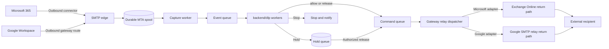
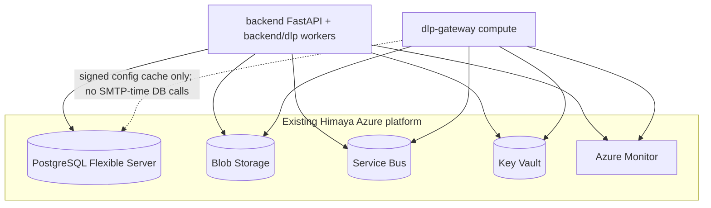
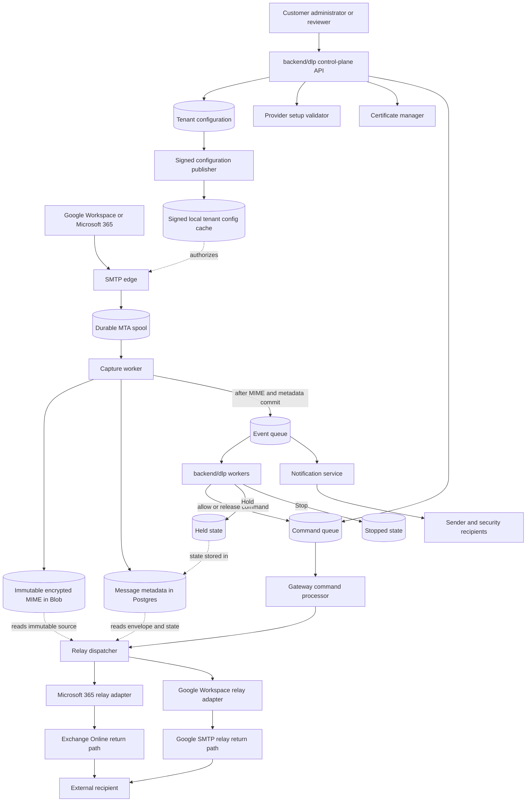
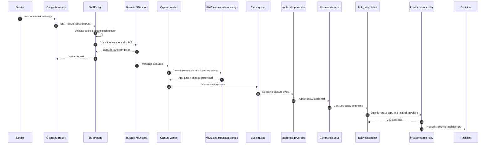
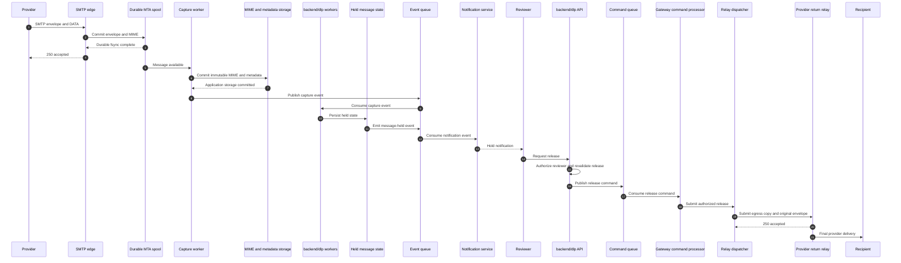
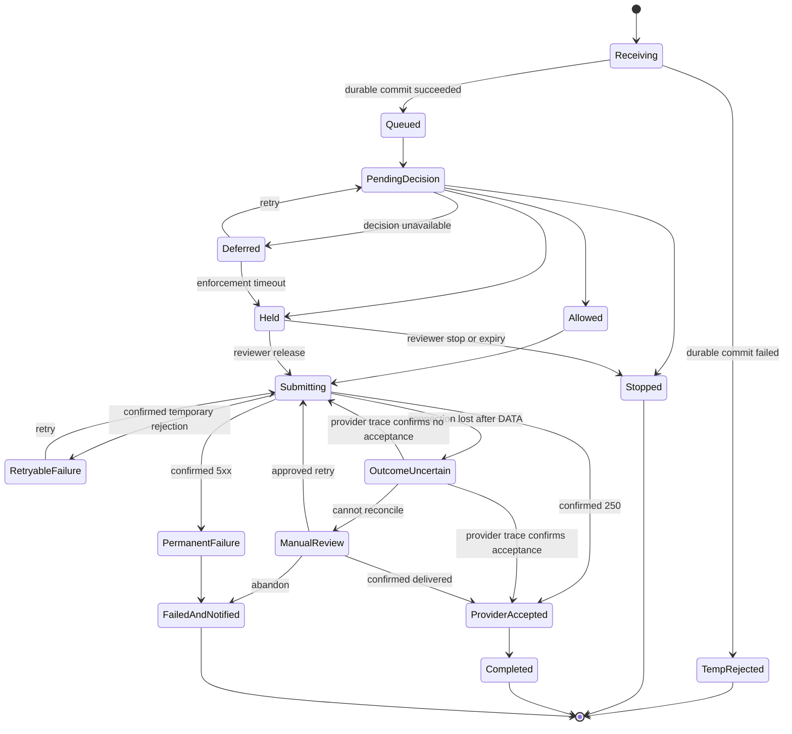
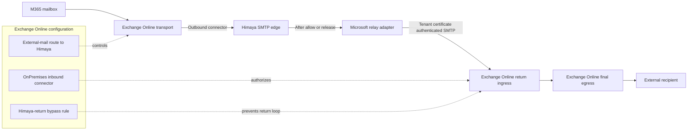
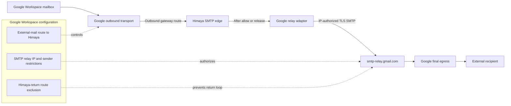
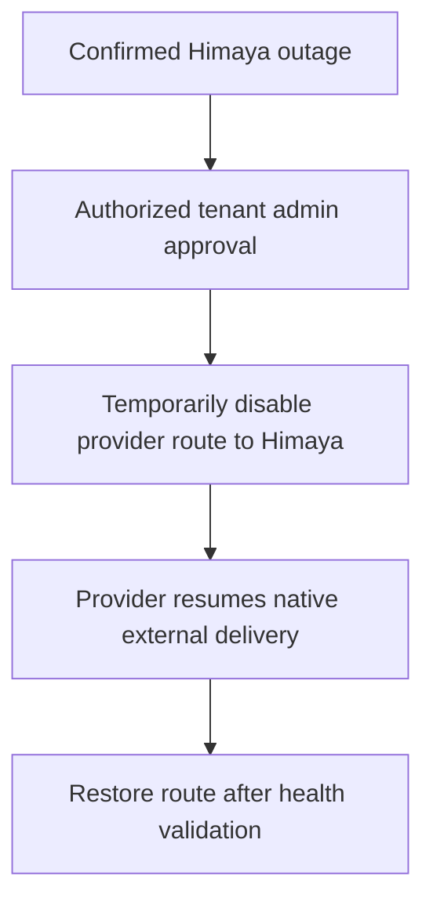
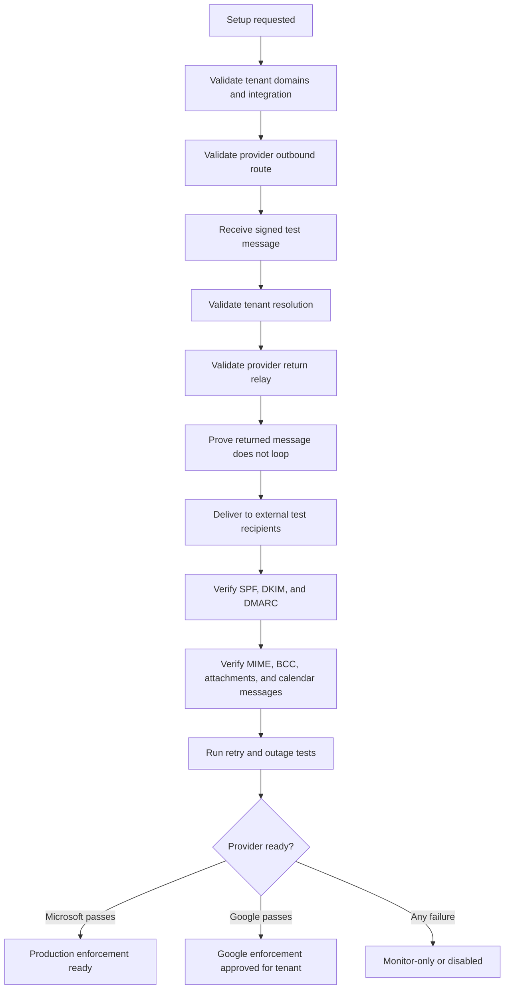

# DLP Ingress Gateway — Recommended Design Plan

## Document status

- **Scope:** Backend ingress, durable holding, and outbound delivery.
- **Providers:** Microsoft 365 and Google Workspace.
- **Excluded for now:** Classification, policy evaluation, audit UI, and frontend design.
- **Primary decision:** Build one durable SMTP gateway and use provider-return delivery.
- **Service boundary:** Gateway lives in a separate `dlp-gateway/` deployable; Enable DLP, policies, classification, and APIs live in `backend/dlp/`.
- **Platform resources:** Reuse existing Himaya PostgreSQL, Blob Storage, Service Bus, and Key Vault with DLP-specific isolation. Gateway compute stays separate.
- **Direct internet delivery:** Not included.
- **Microsoft 365:** Target for production support.
- **Google Workspace:** Must pass a provider-specific proof of concept and readiness gate before enforcement is generally available.

The implementation roadmap for enablement, user targeting, classification, policies, review, APIs, and rollout is in `docs/DLP_BACKEND_IMPLEMENTATION_ROADMAP.md`.

## Refined design prompt

Design a production-grade Data Loss Prevention ingress gateway that receives outbound messages from Microsoft 365 and Google Workspace before external delivery. The gateway must durably preserve the SMTP envelope and original MIME, support allow, hold, release, and stop decisions, and return allowed or released messages to the customer's mail provider for final delivery.

The design must minimize spam placement and preserve the customer's existing sender reputation and email authentication. It must also address provider limitations, routing loops, open-relay abuse, retries, duplicate delivery, ambiguous SMTP outcomes, BCC recipients, attachments, aliases, encrypted messages, large messages, provider quotas, outages, DSNs, and emergency bypass.

## Executive decision

Himaya will implement **one common durable SMTP ingress gateway**.

After inspection:

- Microsoft 365 messages are returned through a tenant-specific Exchange Online connector. Microsoft officially supports this type of third-party processing and relay-back flow when its connector and certificate requirements are met.
- Google Workspace messages are returned through Google SMTP relay only after a mandatory tenant-level POC proves that routing, loop prevention, quotas, authentication, and external delivery work correctly. Google documents this Gmail-originated relay-back pattern as **best effort**, not fully supported.

Himaya will not build or operate a direct-to-recipient MTA in this phase.



## Why direct internet delivery is excluded

If Himaya delivers directly to recipient MX servers, Himaya becomes a full email delivery provider. That requires:

- Customer SPF changes.
- Tenant-specific DKIM signing.
- DMARC alignment management.
- Static outbound IP pools and reputation warm-up.
- Reverse DNS and HELO management.
- Bounce and complaint processing.
- Suppression lists.
- Abuse monitoring.
- Rate management by recipient domain.
- Continuous deliverability operations.

This would add significant cost and operational risk. It is not needed for the first implementation if provider-return delivery passes the required validation.

There is deliberately no automatic direct-delivery fallback. If provider-return delivery is unavailable, Himaya queues the message or an administrator activates a controlled provider-side break-glass bypass.

## Provider support reality

### Microsoft 365

Microsoft supports non-Microsoft services that process outbound messages and relay them back through Exchange Online. Current relay requirements include:

- An Exchange Online `OnPremises` inbound connector.
- Authentication using a certificate or approved static IP.
- Certificate-based authentication is preferred.
- For a cloud service processing tenant mail, Microsoft requires a unique certificate identity for the organization.
- The certificate domain must be an accepted domain in the tenant.
- The SMTP certificate or envelope sender must satisfy current relay attribution requirements.

This makes Microsoft relay-back suitable for production after setup validation.

### Google Workspace

Google supports:

- Sending Gmail outbound messages to a third-party outbound gateway.
- Sending application or on-premises mail through `smtp-relay.gmail.com`.

However, Google explicitly states that Gmail-originated mail routed through a third-party gateway and then returned through Google SMTP relay receives only **best-effort support** because it can cause:

- Mail loops.
- Excessive quota usage.
- Increased security risk.

Therefore:

- Google relay-back is not assumed to work merely because configuration succeeds.
- Every Google tenant must pass automated routing and deliverability tests.
- Google enforcement remains unavailable if the tenant fails validation.
- Himaya must not silently switch the tenant to direct delivery.

## Architecture principles

1. **Durability before acceptance**  
   The MTA spool is the authoritative SMTP acceptance store. Return SMTP `250` only after the full message and envelope are committed and fsynced to durable spool storage.

2. **Preserve the original message**  
   Keep an immutable copy of the received MIME and SMTP envelope. Build an egress transmission copy from that original; never rebuild mail from subject, body, and attachment metadata.

3. **Provider performs final delivery**  
   Google or Microsoft connects to the recipient MX and remains responsible for normal outbound authentication and reputation.

4. **Asynchronous decisioning**  
   SMTP acceptance must not wait for a slow classifier or policy engine.

5. **Connector identity over headers**  
   Trusted network and TLS connector identity determines authorization. Headers are only secondary routing signals.

6. **At-least-once internally, effectively-once externally**  
   SMTP cannot guarantee exactly-once delivery. The design must model ambiguous delivery outcomes instead of blindly retrying.

7. **No automatic fail-open**  
   An infrastructure failure must not silently create an uninspected exfiltration path.

8. **Provider-specific egress behind a common interface**  
   Ingress and queueing are shared. Microsoft and Google delivery behavior is isolated in adapters.

9. **Reuse Himaya platform stores; isolate gateway compute**  
   Use the existing Himaya PostgreSQL, Blob Storage, Service Bus, and Key Vault with DLP-specific tables, containers, queues, and secrets. Deploy `dlp-gateway` on separate compute with durable disks. Do not query Postgres on the SMTP hot path.

## Shared platform resources

For the MVP and initial production cut, DLP does **not** require a separate Azure Postgres cluster.



| Resource | Share with Himaya backend? | Isolation rule |
| --- | --- | --- |
| PostgreSQL | Yes — same instance | New `dlp_*` tables/schema; gateway does not query DB during SMTP acceptance |
| Blob Storage | Yes — same account | Dedicated DLP MIME container/prefix |
| Service Bus | Yes — same namespace | Dedicated DLP capture/command queues or topics |
| Key Vault | Yes — same vault | Separate secrets for gateway certs and config signing keys |
| Compute | No | Separate `dlp-gateway` VMSS/AKS with Postfix and durable Managed Disks |

Split to dedicated Postgres/Service Bus later only if volume, compliance, or blast-radius requirements demand it.

## Canonical architecture

Service and plane terms used throughout this document:

- **`dlp-gateway/` data plane:** SMTP acceptance, durable spool, immutable MIME capture, local config cache, provider-return relay, and command consumption for release/stop/retry.
- **`backend/dlp/` control plane:** Tenant configuration, Enable DLP, setup validation, reviewer authorization, policies, release/stop APIs, certificate management, and health status.
- **`backend/dlp/` application workers:** Extraction, classification, policy evaluation, notifications, and delivery reconciliation. These are not part of the SMTP edge process.
- **Storage plane:** MTA spool, immutable MIME objects, metadata (in shared Postgres), and command/event queues (in shared Service Bus).



Repository placement:

```text
himaya-prod-azure/
├── dlp-gateway/     # SMTP data-plane service
├── backend/dlp/     # Control plane APIs and application workers
└── infra/dlp/       # Legacy scripts only — do not extend for production
```

Full folder trees and ownership tables are in `docs/DLP_BACKEND_IMPLEMENTATION_ROADMAP.md`.

### 1. SMTP edge

Responsibilities:

- Receive outbound SMTP from configured provider routes.
- Require TLS.
- Validate source IP, TLS properties, target gateway hostname, and tenant sender domains.
- Reject unknown or unauthorized relay attempts.
- Enforce connection, message-size, and recipient-count limits.
- Strip untrusted `X-Himaya-*` headers before further processing.
- Commit mail to a durable local or replicated spool before returning `250`.

It must not:

- Call a slow classifier synchronously.
- Trust an organization ID supplied only in a message header.
- Accept arbitrary sender domains.
- Relay arbitrary internet mail.

### 2. Tenant resolver

Tenant identity should be derived from several signals:

1. Tenant-specific gateway hostname.
2. Configured provider integration.
3. Trusted source provider.
4. TLS connector or certificate identity where available.
5. Envelope sender domain.
6. Verified alias and accepted-domain configuration.

No single user-controlled header may select a tenant.

Recommended hostname:

```text
<tenant-routing-id>.smtp.dlp.himaya.ai
```

The routing ID should be random and non-guessable. It is not a secret and must not be the only authorization control.

### 3. Durable queue and MIME storage

The durability boundary is fixed:

1. The SMTP edge writes the complete envelope and MIME to the MTA spool.
2. The spool commit is fsynced on durable persistent storage.
3. The SMTP edge returns `250`.
4. The capture worker copies the immutable MIME into encrypted object storage and commits message metadata.
5. Only after both MIME and metadata commits succeed does the capture worker publish a capture event to the event queue.
6. The MTA spool entry is not eligible for cleanup until the object and metadata commits succeed.

The durable MTA spool is therefore sufficient for SMTP acceptance. Object storage is the application-owned copy used by decisioning, hold/release, investigation, and recovery. Backend workers start only after the capture event is published — metadata storage alone does not imply an event was emitted.

Before returning SMTP `250`, the spool must contain:

- SMTP envelope sender.
- Every SMTP envelope recipient.
- Original raw MIME bytes.
- Provider and tenant identity.
- SMTP session identifier.
- Message size.
- Receive timestamp.

The capture worker subsequently records:

- Raw MIME SHA-256.
- Provider trace identifiers where available.
- Object storage reference.
- Application message state.

The SMTP envelope is separate from MIME headers. This is required because BCC recipients are usually absent from `To` and `Cc`.

The application-owned MIME object must be:

- Encrypted at rest.
- Stored with tenant isolation.
- Covered by retention and deletion policies.
- Streamed rather than loaded entirely into memory.
- Immutable after capture.
- Used to construct release transmissions without MIME reconstruction.

### 4. Backend decision path

Classification and policy evaluation run in `backend/dlp/` workers after the gateway publishes a capture event. They are not part of the SMTP edge process.

For this gateway design, the backend only needs a stable decision contract published as commands/events:

```text
allow
hold
stop
defer
```

Those workers must be:

- Idempotent.
- Retryable.
- Independent of the SMTP connection.
- Able to move failed decisions into a safe deferred state.
- Able to publish allow/release/stop commands for `dlp-gateway` to execute.

### 5. Provider relay dispatcher

The dispatcher:

- Uses the original envelope recipients.
- Creates an egress transmission copy from the immutable MIME object.
- Selects the tenant's provider adapter.
- Adds only approved transport metadata.
- Records the SMTP transaction and response.
- Does not reconstruct attachments or body content.
- Does not blindly retry an ambiguous post-`DATA` failure.

### 6. Control plane

The control plane lives in `backend/dlp/` and:

- Authenticates administrators and reviewers.
- Stores tenant and provider configuration.
- Validates provider setup.
- Authorizes release and stop operations.
- Publishes commands to the `dlp-gateway` data plane.
- Manages Microsoft tenant certificates.
- Publishes signed configuration snapshots to gateway caches.

The SMTP edge must not synchronously query the control-plane API or PostgreSQL during SMTP commands. It uses the last valid signed local configuration snapshot. If no valid snapshot exists for the tenant, the edge temporarily rejects the message.

### 7. Notification service

The notification service lives with backend workers. It consumes message-state events and sends sender/security notifications. SMTP edges and gateway relay workers emit events but do not directly send user notifications.

## End-to-end message flow

### Allow



### Hold and release



### Stop

After Himaya has returned `250` to the provider, a stop decision is handled internally:

1. Do not relay the message.
2. Move it to `stopped`.
3. Emit a stopped event for the notification service.
4. Let the notification service notify the internal sender and configured security recipients.
5. Do not generate a message to the external recipient.
6. Do not create backscatter.

## Message state model



## SMTP delivery semantics and duplicate prevention

SMTP does not provide true exactly-once delivery.

Example:

1. Himaya sends the full message to the provider.
2. Provider accepts and queues it.
3. Provider's `250` response is lost because the connection drops.
4. Himaya cannot know whether the provider accepted the message.

Blindly retrying can create a duplicate. Treating it as delivered can lose a message if the provider did not accept it.

Required handling:

- Record SMTP command and response progression.
- Mark connection loss after `DATA` as `outcome_uncertain`.
- Use Exchange message trace or Google Email Log Search where available.
- Do not automatically retry an uncertain outcome until reconciliation or an explicit timeout policy.
- Provide manual review when reconciliation cannot determine the result.
- Use stable Himaya trace headers and message hashes for investigation.

Idempotency protects internal workers but cannot completely eliminate duplicates after ambiguous remote SMTP acceptance.

## Loop prevention

Potential loop:

```text
Provider -> Himaya -> Provider -> Himaya -> Provider ...
```

Loop prevention must use multiple controls.

### Primary controls

- Return mail through a tenant-specific trusted connector or relay configuration.
- Provider routing rules exclude messages received through the Himaya return path.
- Microsoft return authentication uses tenant-specific connector/certificate identity.
- Google return configuration uses registered Himaya IPs and validated tenant sender domains.

### Secondary controls

On return, add:

```text
X-Himaya-DLP-Version: 1
X-Himaya-DLP-Tenant: <tenant-routing-id>
X-Himaya-DLP-Trace: <stable-message-trace-id>
X-Himaya-DLP-Signature: <short-lived-HMAC>
```

Rules:

- Strip all inbound `X-Himaya-*` values before initial inspection.
- Generate new values only inside the trusted relay dispatcher.
- Never configure bypass using the header alone.
- Require connector/source identity plus the marker.
- Reject or quarantine re-entry carrying a valid Himaya return marker.
- Enforce a maximum Himaya hop count.

## Microsoft 365 design

### Mail flow



### Required tenant configuration

1. Outbound connector from Exchange Online to the tenant's Himaya gateway hostname.
2. Rule scoped to external recipients and intended users/groups.
3. TLS required and Himaya certificate hostname validated.
4. `OnPremises` inbound connector for Himaya return traffic.
5. Tenant-specific Himaya TLS certificate identity.
6. Certificate domain added as an accepted tenant domain as required by Microsoft.
7. Bypass rule scoped to the trusted return connector.
8. Validation using Exchange message trace.

### Microsoft readiness requirements

- Original external message reaches Himaya exactly once in the normal case.
- Returned message bypasses the outbound Himaya route.
- Exchange accepts relay to external recipients.
- SPF, DKIM, and DMARC pass at test recipients.
- Aliases and shared mailboxes work.
- Null envelope sender behavior is understood.
- Attachments, calendar messages, and signed MIME remain intact.
- Message trace can reconcile uncertain delivery.

## Google Workspace design

### Mail flow



### Required tenant configuration

1. Outbound gateway or routing rule sends external outbound mail to the tenant's Himaya gateway hostname.
2. TLS is required and the Himaya certificate hostname is validated.
3. Google SMTP relay is configured to accept only Himaya's registered static IPs.
4. Allowed senders are restricted to tenant domains or registered users.
5. Google return routing excludes messages received through the Himaya return path.
6. Himaya does not use SMTP AUTH credentials shared across tenants.
7. Email Log Search is available for setup testing and uncertain-outcome investigation.

### Google-specific constraints

- Gmail-originated third-party-to-Google relay-back has only best-effort Google support.
- Google relay has per-user and organization quotas.
- There is a 100-recipient limit per SMTP transaction.
- Null envelope sender behavior has additional restrictions.
- Returned messages can consume relay quotas.
- A routing mistake can create loops and rapid quota exhaustion.

### Recipient splitting

When a message exceeds Google's per-transaction recipient limit:

- Split only the SMTP envelope into deterministic recipient batches.
- Create each transmission from the same immutable MIME object and approved Himaya transport headers.
- Track acceptance separately for every batch and recipient.
- Never resend to recipients already confirmed as accepted.
- A partial failure must not move the whole message back to a generic retry state.

### Google availability policy

Google enforcement is enabled only after the tenant passes the complete readiness suite.

If validation fails:

- Do not enable inline enforcement.
- Keep DLP in monitor-only mode if a non-blocking integration is available.
- Show the exact failing setup check.
- Do not switch to direct Himaya delivery.

## Deliverability requirements

### Message mutation

Himaya maintains two representations:

1. **Immutable original MIME object**  
   The exact message captured from the MTA spool. It is never modified.

2. **Egress transmission copy**  
   A transmission generated from the immutable object with approved Himaya transport headers prepended. The body, attachments, MIME structure, and original signed headers remain unchanged.

The egress copy must not modify:

- MIME body.
- MIME boundaries.
- Subject.
- `From`, `To`, `Cc`, `Date`, or `Message-ID`.
- Attachment encoding.
- Existing S/MIME or PGP content.
- Headers covered by an existing DKIM signature.

Himaya transport headers are added only to the egress copy. They are not written back to the immutable object. Deliverability tests must verify whether provider DKIM is applied or preserved in each flow.

### Authentication validation

Before enforcement:

- SPF must pass or be correctly aligned for final provider delivery.
- DKIM must pass.
- DMARC must pass.
- The final connecting IP observed by recipients must be the intended provider.
- Existing customer DKIM selectors must remain valid.
- No Himaya IP should unexpectedly appear as final recipient-facing egress.

Test recipients must include:

- Gmail.
- Outlook.com.
- Yahoo.
- A custom domain using a major secure email gateway.
- A tenant-controlled test domain where full headers and SMTP logs are available.

## Hold behavior

Because the original provider has already received `250` from Himaya:

- The sender may see the message in Sent Items while it is still held.
- Himaya must notify the sender that external delivery is pending review.
- The notification must use a separate internal notification channel/message.
- The held message must never be modified to embed a warning.

Recommended defaults:

- Default hold expiry: 24 hours.
- Maximum configurable hold: 72 hours.
- Revalidate tenant integration and recipient authorization before release.
- On expiry, move to stopped unless tenant configuration explicitly retains it.
- Do not change the original `Date` header on release.

Long holds can create confusing timestamps or stale calendar invitations. Policies should use short review windows.

## DSN and failure ownership

After Himaya returns SMTP `250`, Himaya owns the next delivery step.

### Provider accepts return submission

Once Google/Microsoft returns `250`:

- Provider owns normal final delivery.
- Provider handles remote recipient deferrals and bounces.
- Himaya records `provider_accepted`.

### Provider permanently rejects before acceptance

Himaya must:

- Record the permanent SMTP response.
- Stop retrying.
- Notify the original internal sender and security team.
- Provide a human-readable failure reason.
- Avoid sending a DSN to an untrusted or external envelope sender.

### Provider temporarily rejects

Himaya must:

- Preserve the message in queue.
- Retry with bounded exponential backoff.
- Respect provider retry hints.
- Alert when retry age exceeds the service objective.

### Null envelope senders

Messages with `MAIL FROM: <>` require special handling:

- Never generate a DSN in response to another DSN.
- Apply provider-specific relay restrictions.
- Route operational failures to tenant administrators.

## Failure modes

| Scenario | Required behavior |
| --- | --- |
| Gateway unavailable before SMTP connection | Provider queues and retries. No automatic bypass. |
| Queue/storage unavailable during SMTP | Return temporary `451`; never return `250`. |
| Gateway crashes after durable commit | Recover message from durable spool and continue processing. |
| Decision engine unavailable | Move to `deferred`, retry, then safe-hold in enforcement mode. |
| Provider return relay temporarily rejects | Retry with bounded backoff. |
| Provider return relay permanently rejects | Stop, notify sender/admin, preserve evidence. |
| Connection lost after sending DATA | Mark `outcome_uncertain`; reconcile before retry. |
| Duplicate inbound provider retry | Deduplicate internal processing using trace IDs and MIME/envelope hashes. |
| Routing loop detected | Stop relay, quarantine message, disable tenant route health, alert operations. |
| Spoofed Himaya bypass header | Strip it; connector identity is required for bypass. |
| Unknown sender domain | Reject before acceptance. |
| Untrusted SMTP source | Reject before acceptance. |
| Large message | Stream to storage; enforce tenant/provider size limits before acceptance. |
| More than 100 Google recipients | Split envelope deterministically and track per-recipient acceptance. |
| BCC recipients | Preserve and relay SMTP envelope recipients. |
| Alias/shared mailbox | Validate against synchronized accepted senders and domains. |
| S/MIME/PGP message | Preserve bytes exactly; future policy decides inspectability action. |
| Password-protected attachment | Preserve bytes; mark inspection limitation for future decisioning. |
| Regional outage | Provider retries alternate healthy gateway targets. |
| Queue capacity exhausted | Return `451` and alert; do not accept untrackable mail. |

## Security model

### Anti-open-relay controls

- Accept SMTP only from configured provider networks or connectors.
- Require a known tenant-specific gateway hostname.
- Require the envelope sender domain to belong to the tenant.
- Restrict relay recipients to the envelope received from the trusted provider.
- Do not expose authenticated generic SMTP submission to customers.
- Apply per-tenant rate and volume limits.
- Reject source/provider/domain mismatches.

### Transport security

- Require TLS from provider to Himaya.
- Require TLS from Himaya to provider.
- Validate certificate hostname.
- Use tenant-specific certificates for Microsoft return relay.
- Rotate certificates without interrupting active connectors.
- Store private keys in a managed key vault or HSM-backed service.

### Data protection

- Encrypt raw MIME at rest.
- Isolate storage by tenant.
- Use short-lived access to message objects.
- Never place message bodies in standard logs.
- Apply explicit retention to held, stopped, and successfully relayed messages.
- Delete successful transient MIME after the configured retention period.

## Availability and backpressure

### SMTP edge deployment

- Deploy at least two SMTP edges across separate failure domains.
- Publish multiple provider-supported smart-host targets.
- Use static egress IPs.
- Keep accepted mail on durable encrypted storage.
- Drain instances before maintenance.
- Do not remove an instance while it owns an unreconciled spool.

### Backpressure rules

- Backend decision workers may lag without breaking SMTP acceptance while queue capacity remains.
- Queue high-water marks trigger alerts and admission control.
- At the hard limit, SMTP returns `451`.
- Never return `250` merely to keep sender latency low.

### Service objectives

Initial targets:

- SMTP durable acceptance p95: under 5 seconds.
- Allowed message provider resubmission p95: under 60 seconds, excluding future classification time.
- No silent message loss.
- Hold release initiated within 30 seconds of reviewer action.
- Routing loop detection before a second Himaya processing cycle.

## Emergency bypass

Emergency bypass is a provider-side administrative action, not direct Himaya delivery.



Requirements:

- Manual activation by an authorized customer administrator.
- Visible warning that mail will not receive DLP enforcement.
- Time-limited change where provider automation permits.
- Notifications to customer and Himaya operations.
- Setup validation rerun before restoring enforcement.
- Full audit trail when audit design is implemented.

Do not implement automatic bypass based only on a health check. An attacker or outage could otherwise create an automatic exfiltration window.

## Backend interfaces

### Gateway relay adapter vs backend setup adapters

Keep SMTP relay and provider admin setup as separate interfaces.

**`dlp-gateway` — `ProviderRelayAdapter` (data plane, SMTP only):**

```text
ProviderRelayAdapter
  submit(message_ref, envelope)
  query_delivery(trace_id)
  classify_smtp_result(result)
  health_check(tenant)
```

Implementations live under `dlp-gateway/`:

- `Microsoft365RelayAdapter`
- `GoogleWorkspaceRelayAdapter`

**`backend/dlp/providers/` — setup adapters (control plane, not SMTP):**

```text
ProviderSetupAdapter
  validate_setup(tenant)
  create_or_update_connectors(tenant)
  apply_routing_scope(tenant, scope)
  health_check(tenant)
```

Implementations:

- `backend/dlp/providers/microsoft.py`
- `backend/dlp/providers/google.py`

Setup validation may call gateway health checks, but gateway relay code must not own connector or group provisioning.

### Control/data-plane commands

The control plane communicates with workers through durable commands rather than direct SMTP-gateway calls:

```text
release_message(message_id, reviewer_id, expected_state)
stop_message(message_id, reviewer_id, expected_state, reason)
retry_submission(message_id, operator_id, expected_state)
publish_tenant_config(tenant_id, config_version, signature)
```

Workers publish durable events for state changes and notifications:

```text
message_held
message_stopped
provider_submission_accepted
provider_submission_deferred
provider_submission_failed
submission_outcome_uncertain
```

### Message record

Minimum fields:

```text
id
tenant_id
provider
provider_integration_id
provider_trace_id
smtp_session_id
message_id_header
envelope_mail_from
envelope_recipients
raw_mime_storage_ref
raw_mime_sha256
message_size_bytes
state
recipient_delivery_states
decision_attempts
submission_attempts
last_smtp_stage
last_smtp_code
last_error
received_at
hold_expires_at
provider_accepted_at
```

## Setup and readiness workflow



Setup states:

```text
not_configured
validating
route_verified
return_relay_verified
deliverability_verified
ready
degraded
failed
break_glass_active
```

Enforcement must require `ready`.

## Mandatory POC acceptance criteria

Classification is not required for this POC. Use hardcoded allow, hold, and stop decisions.

### Common tests

- Message is accepted only after durable commit.
- Allow reaches all test recipients.
- Hold prevents external delivery.
- Release delivers an egress copy whose body, MIME structure, attachments, and original envelope are preserved.
- Stop never reaches the external recipient.
- BCC recipients are preserved.
- Multiple attachments are preserved byte-for-byte.
- HTML, plain text, inline images, calendar invites, S/MIME, and PGP test messages remain valid.
- Alias and shared-mailbox senders work.
- Spoofed Himaya headers cannot bypass the gateway.
- Unknown domains and untrusted sources cannot relay.
- Queue failure returns `451`.
- Provider retry does not create normal-path duplicates.
- Ambiguous SMTP outcome enters `outcome_uncertain`.
- Gateway outage causes provider queueing rather than silent loss.
- SPF, DKIM, and DMARC pass.

### Microsoft production gate

- Tenant-specific certificate relay works.
- Exchange Online accepts external relay through the inbound connector.
- Connector-scoped bypass prevents loops.
- Exchange message trace can locate a Himaya trace ID.
- Permanent and temporary SMTP failures are distinguishable.
- All common tests pass.

### Google tenant gate

- Gmail outbound route reaches the correct tenant gateway.
- Google SMTP relay accepts Himaya return traffic.
- Returned mail bypasses the Himaya outbound route.
- No loop occurs under retries.
- Google Email Log Search identifies the Himaya trace.
- Recipient splitting works above 100 recipients.
- Per-user and organization quota behavior is measured.
- Null envelope sender behavior is tested.
- All common tests pass over a sustained test window.

If the Google gate fails, Google enforcement must remain disabled. This is a product limitation, not a reason to enable direct delivery automatically.

## Implementation plan

### Phase 0 — provider feasibility

- Build a minimal SMTP gateway with durable spool.
- Hardcode allow/hold/stop.
- Create one Microsoft test tenant and one Google test tenant.
- Prove both round-trip paths.
- Record complete headers and provider traces.
- Decide whether Google relay-back meets the readiness gate.

Do not build classification before this phase succeeds.

### Phase 1 — common gateway

- Implement SMTP edge and tenant resolution.
- Implement durable MTA spool acceptance and asynchronous immutable MIME capture.
- Add internal message state machine.
- Add source/domain authorization.
- Add stripping and signing of Himaya transport headers.
- Add queue recovery and backpressure.
- Add signed tenant-configuration publishing and local SMTP-edge caches.
- Add command and event queues between the control and data planes.

### Phase 2 — Microsoft production adapter

- Automate connector setup where supported.
- Implement tenant-specific certificate lifecycle.
- Implement Exchange relay submission.
- Integrate Exchange message tracing for reconciliation.
- Complete Microsoft readiness tests.

### Phase 3 — Google gated adapter

- Implement Google SMTP relay submission.
- Implement recipient batching.
- Add quota telemetry.
- Integrate Email Log Search where available.
- Complete extended loop and quota testing.
- Enable only tenants that pass setup validation.

### Phase 4 — hold and operations

- Add hold/release/stop operations.
- Add sender and administrator notifications.
- Add hold expiry.
- Add uncertain-outcome reconciliation.
- Add emergency bypass status and runbook.

### Phase 5 — resilience

- Deploy multiple SMTP edges.
- Add regional failure tests.
- Add operational dashboards and alerts.
- Run repeated deliverability tests.
- Perform open-relay and header-spoofing security tests.

## Estimated operating cost

These figures are planning estimates, not a vendor quote. They assume Azure **UAE North** (Middle East), pay-as-you-go pricing, and exclude:

- Classification/LLM or OCR cost.
- Provider licensing, including Microsoft 365 or Google Workspace licenses.
- Customer implementation/onboarding labor.
- Existing shared Himaya platform costs.
- Taxes, premium support, and enterprise security tooling.

Azure UAE North is the working regional assumption. UAE Central, Qatar Central, a different Azure offer, reservations, hybrid benefit, and private pricing can materially change these amounts. Use Azure Pricing Calculator with the production subscription before committing a customer price.

### Azure deployment mapping

| Gateway responsibility | Azure service direction |
| --- | --- |
| Stateful SMTP edge and durable MTA spool | New Azure Virtual Machine Scale Set or AKS workload with Managed Disks; separate from FastAPI compute |
| Gateway capture, relay, and command workers | Same `dlp-gateway` pods/nodes as the SMTP edge, or adjacent workers that share the gateway deployment |
| Backend classification, policy, setup, and notify workers | Existing FastAPI/worker pool under `backend/dlp/workers/` |
| Immutable MIME objects | Existing Himaya Azure Blob Storage account; dedicated DLP container/prefix |
| Metadata database | Existing Himaya Azure Database for PostgreSQL Flexible Server; new `dlp_*` tables/schema |
| Commands and events | Existing Himaya Azure Service Bus namespace; dedicated DLP queues/topics |
| TCP ingress | Azure Standard Load Balancer with static public IPs; SMTP is TCP, not HTTP |
| Secrets and certificates | Existing Himaya Azure Key Vault; separate gateway cert and config-signing secrets |
| Logs and metrics | Existing Azure Monitor, Log Analytics, and Application Insights with DLP dimensions |

The gateway should run SMTP edges on stateful Azure infrastructure with durable Managed Disks. Do **not** use an ephemeral-only container runtime as the sole durable MTA spool. AKS with persistent volumes, a VM Scale Set, or dedicated VMs are suitable; the important requirement is the durable spool described above.

Cost tables below estimate **incremental** DLP spend on top of the shared Himaya platform. Do not double-count the existing Postgres, Blob, Service Bus, or Key Vault baseline unless DLP forces a size upgrade.

### Main cost drivers

1. **Always-on high availability**  
   At least two SMTP edges, two availability zones, durable disks, a database, and a TCP load balancer.

2. **Outbound data transfer**  
   Every allowed or released message is sent from Himaya back to Google/Microsoft. That gateway-to-provider leg is internet egress from the cloud account and usually becomes the main variable cost at volume.

3. **Raw MIME retention**  
   Message size, the percentage held/stopped, and retention time determine object-storage cost. A short retention period for allowed messages materially reduces cost.

4. **Logs and observability**  
   Logging raw MIME or verbose SMTP transcripts is both a security issue and a potentially large cost. Log metadata and correlation IDs, not message bodies.

5. **Google recipient batching and retries**  
   A Google tenant with large recipient lists, misconfigured routing, or persistent retries can increase traffic and queue cost. The readiness gate prevents enabling enforcement for that tenant before this is measured.

### Cost model

Use the following inputs for a tenant or the full platform:

```text
monthly_payload_gb =
  messages_per_month × average_on_wire_message_size_mb ÷ 1024

provider_return_egress_gb =
  monthly_payload_gb × (allowed_messages + released_messages) / total_messages

retained_mime_gb =
  monthly_payload_gb × retained_message_fraction × retention_days / 30
```

Example: 1,000,000 messages/month at an average 1 MB on-wire size is about 977 GB of monthly payload. If most messages are allowed, approximately that same volume is sent from Himaya back to the provider. If all messages are retained for 30 days, object storage holds about 977 GB; retaining only held/stopped messages and seven days of allowed messages is substantially cheaper.

### Monthly infrastructure ranges

| Deployment profile | Included baseline | Estimated monthly cost | Suitable use |
| --- | --- | ---: | --- |
| POC, single availability zone | One stateful SMTP edge, one small worker; uses shared Himaya Postgres/Blob/Service Bus; minimal extra monitoring | **US$150–400** incremental | Provider feasibility testing only; not production HA |
| Production, one region and HA | Two SMTP edges across zones, gateway workers, Managed Disks, Standard Load Balancer; shared Postgres/Service Bus/Key Vault sized as needed | **US$400–1,000** incremental | Initial production service at low/moderate volume; excludes full shared-platform baseline |
| Production, one region, 1 TB monthly return egress | HA gateway baseline plus ~1 TB provider-return traffic, 0.3–1 TB retained MIME, controlled Log Analytics volume | **US$600–1,400** incremental | Roughly 1M messages/month at 1 MB average |
| Production, one region, 10 TB monthly return egress | Scaled SMTP/worker capacity, possible DB/queue size-up, 3–10 TB retained MIME, controlled logs | **US$3,500–7,500+** incremental | Roughly 10M messages/month at 1 MB average |

These ranges are **incremental DLP cost** on top of the existing Himaya platform, not a full replacement stack. They are intentionally broad because message size distribution and provider-return traffic dominate variable cost. Attachments make average message size much more important than raw message count.

If DLP forces a Postgres HA upgrade that Himaya would not otherwise need, attribute that delta to DLP. Do not charge the full shared Postgres bill to DLP alone.

### Approximate cost composition for one HA region

| Component | Planning range/month | Notes |
| --- | ---: | --- |
| Two stateful SMTP edges with Managed Disks | US$150–400 | VM Scale Set, AKS node pool, or dedicated VMs; size for concurrent SMTP and spool capacity |
| Decision/relay/capture workers | US$75–250 | Gateway capture/relay workers plus separate backend classify/evaluate workers; exclude LLM classifier cost |
| PostgreSQL metadata store | US$0–650 | Prefer shared Himaya Flexible Server; range is DLP-driven size-up or HA delta only |
| Standard Load Balancer and static IPs | US$25–90 | TCP SMTP ingress; charges include rules and processed data |
| Service Bus, Key Vault, DNS, certificates | US$20–100 | Usually low at initial volume but depends on operations and certificate count |
| Blob Hot LRS storage | about US$52/TB-month | UAE North planning rate; transactions, replication, lifecycle, and retrieval are additional |
| Provider-return internet egress | about US$100–150/TB | Middle East/Africa tier and enterprise agreement dependent; validate against the subscription price sheet |
| Azure Monitor, traces, and sanitized logs | US$50–300 | Analytics Logs ingestion can be about US$2.30/GB; sampling and Basic/Auxiliary Logs are important |

### Cost controls

- Keep the durable MTA spool on attached disks and use object storage as the application-owned durable copy.
- Retain allowed message MIME for the shortest operationally safe period; retain held/stopped/failed messages longer.
- Add object-storage lifecycle rules to cheaper storage classes after the active investigation period.
- Use Azure Private Endpoints for Blob Storage, PostgreSQL, Key Vault, and Service Bus where supported to avoid unnecessary public traffic and simplify isolation.
- Do not place SMTP edges behind Azure NAT Gateway for return delivery; use controlled static egress IPs and direct routing where the security model permits. NAT Gateway hourly and per-GB processing charges otherwise add avoidable cost.
- Use TCP load balancing for SMTP; do not pay for HTTP-specific features that SMTP cannot use.
- Cache signed tenant configuration at SMTP edges to avoid a database/API call per SMTP command.
- Sample and redact SMTP diagnostics; never send raw message content to centralized logs.
- Set queue and storage alarms based on bytes as well as message count.
- Recalculate the model per tenant before enabling Google enforcement because relay retries or recipient batching can increase traffic.

### Commercial implication

The service should not be priced only per mailbox. A sustainable model needs a payload or attachment-volume allowance because a small number of large messages can cost more than thousands of plain-text messages.

Recommended product meters:

- Protected mailboxes.
- Outbound messages inspected.
- Outbound payload GB inspected.
- Retained hold/quarantine storage GB-month.
- Premium data residency or multi-region HA.

## Cost validation during Phase 0

The feasibility POC must record:

- Average and p95 on-wire message size.
- MIME payload retained per message state.
- Return-egress bytes per accepted message.
- Provider retry rate.
- Google batching frequency and retry amplification.
- SMTP edge CPU, memory, disk IOPS, and spool age.
- Log volume per message.

Use those measurements to replace the estimates above with a tenant-specific unit cost before general availability.

## Changes required from the current implementation

The existing DLP gateway and release flow should not be extended as-is.

Required changes:

- Replace synchronous pre-queue milter classification with durable after-queue processing.
- Stop returning SMTP `550` as the representation of a human hold.
- Stop depending on webhook HTTP status codes for provider enforcement.
- Store an immutable raw MIME object and the complete SMTP envelope.
- Stop reconstructing released messages through subject/body-only Gmail or Graph requests.
- Replace shared-header tenant selection with trusted connector and domain resolution.
- Add provider adapters and provider-specific readiness states.
- Add `outcome_uncertain` and reconciliation behavior.
- Add per-recipient delivery tracking for Google batching.
- Remove direct-MTA fallback from the implementation plan.

## Open decisions

These must be finalized after Phase 0:

1. Whether Google relay-back is reliable enough for general availability or must remain limited availability.
2. Which durable SMTP spool technology to operate.
3. Which tenant-specific certificate automation model to use for Microsoft.
4. Retention periods for allowed, held, stopped, and failed messages.
5. Maximum queue age before customer escalation.
6. Availability regions and data-residency boundaries.

## Final recommendation

Build only the provider-return gateway. Do not build a direct-to-internet fallback.

Use one shared durable ingress and queue architecture, but do not pretend the two provider egress paths have identical support:

- **Microsoft 365:** production relay-back through a correctly configured tenant-specific connector and certificate.
- **Google Workspace:** POC-gated relay-back with strict loop, quota, and deliverability validation.

If Google does not pass the gate, keep Google enforcement unavailable or monitor-only until a separate supported egress decision is approved. Do not solve that problem by silently turning Himaya into an outbound email provider.

## References

- [Microsoft — Requirements for SMTP relay through Exchange Online](https://learn.microsoft.com/en-us/exchange/mail-flow-best-practices/updated-requirements-smtp-relay)
- [Microsoft — Configure applications and devices to relay through Microsoft 365](https://learn.microsoft.com/en-us/exchange/mail-flow-best-practices/how-to-set-up-a-multifunction-device-or-application-to-send-email-using-microsoft-365-or-office-365)
- [Google — Route outgoing SMTP relay messages through Google](https://support.google.com/a/answer/2956491?hl=en)
- [Google — Add an outbound gateway for outgoing email](https://support.google.com/a/answer/178333)
- [Google — Gmail API usage limits](https://developers.google.com/workspace/gmail/api/reference/quota)
- [Azure — Pricing Calculator](https://azure.microsoft.com/en-us/pricing/calculator/)
- [Azure — PostgreSQL Flexible Server pricing](https://azure.microsoft.com/en-us/pricing/details/postgresql/flexible-server/)
- [Azure — Managed Disks pricing](https://azure.microsoft.com/en-us/pricing/details/managed-disks/)
- [Azure — Load Balancer pricing](https://azure.microsoft.com/en-us/pricing/details/load-balancer/)
- [Azure — Monitor pricing](https://azure.microsoft.com/en-us/pricing/details/monitor/)
