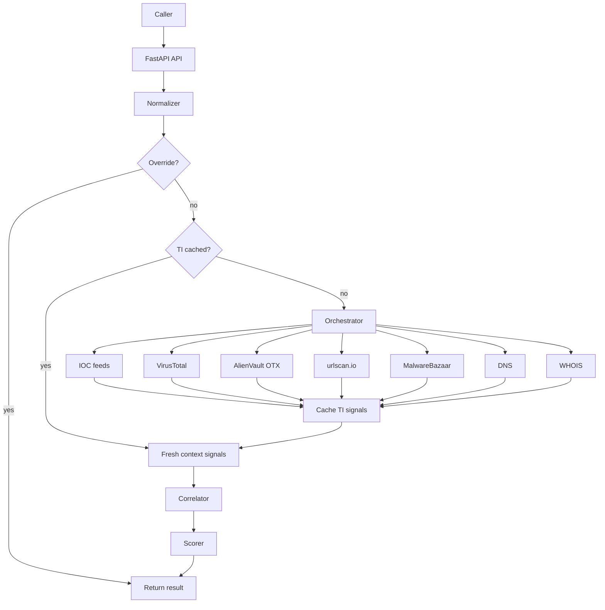

# Reputation Service Architecture

## Purpose

The Reputation Service centralizes sender, domain, URL, file-hash, and IP reputation lookup behind one FastAPI contract. It is deployed independently from `sentinel-mail/`.

**Sentinel-mail engineers:** start with [SENTINEL_MAIL_INTEGRATION.md](./SENTINEL_MAIL_INTEGRATION.md).

## High-level flow

See [WORKFLOW.md](./WORKFLOW.md) for the full step-by-step pipeline.

## Core components

| Component | Role |
|-----------|------|
| `app/api/routes.py` | HTTP endpoints |
| `app/api/schemas.py` | Request/response models and validation |
| `app/core/normalizer.py` | Entity normalization and cache keys |
| `app/core/cache.py` | Redis/memory cache for TI signals |
| `app/core/orchestrator.py` | Lookup pipeline and adapter coordination |
| `app/core/correlator.py` | Multi-source agreement |
| `app/core/scorer.py` | Deterministic 0–100 scoring |
| `app/sources/registry.py` | Config-driven adapter loading |

## Source adapters (v1)

| Adapter | File | Entities |
|---------|------|----------|
| IOC feeds | `ioc_feeds.py` | domain, url, ip |
| VirusTotal | `virustotal.py` | domain, url, file |
| AlienVault OTX | `alienvault.py` | domain, url, file |
| urlscan.io | `urlscan.py` | domain, url, ip |
| MalwareBazaar | `malwarebazaar.py` | file |
| DNS | `dns.py` | domain |
| WHOIS | `whois.py` | domain |

Config: `app/config/sources.yaml`

## Cache model

- **Cached:** threat-intel adapter output (`SourceSignal` list), 72h TTL (15m when all sources unknown)
- **Not cached:** auth results, URL/file heuristics (recomputed every request)
- **Overrides:** admin-forced verdicts on `{key}:override`

## Adding a new source

1. Create `app/sources/<name>.py` implementing `ThreatIntelAdapter`
2. Map vendor data → `SourceSignal`
3. Register in `app/sources/registry.py`
4. Add entry in `app/config/sources.yaml`
5. Add tests

No API or scorer changes needed unless the source introduces a new signal category.
