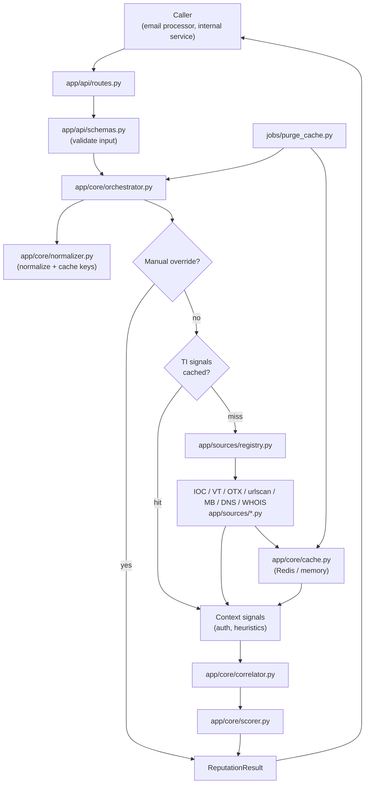

# Reputation Service — Workflow & File Guide

This document explains how a lookup request moves through the microservice and what each file is responsible for.

For endpoint details see [API.md](./API.md). For scoring rules see [SCORING.md](./SCORING.md).

**Sentinel-mail integration:** [SENTINEL_MAIL_INTEGRATION.md](./SENTINEL_MAIL_INTEGRATION.md)

---

## What the service does

The Reputation Service answers one question for multiple entity types:

> **Is this sender, domain, URL, file hash, or IP benign, suspicious, or malicious — and why?**

It is a **standalone FastAPI app** under `reputation-service/`. It does not import `sentinel-mail/`. Callers (e.g. the Helios email processor) send structured entities and optional context; the service returns a score, verdict, confidence, indicators, and an explainable summary.

**V1 sources:** IOC feeds, VirusTotal, AlienVault OTX, urlscan.io, MalwareBazaar, DNS, WHOIS.

---

## End-to-end lookup workflow

### 1. Request arrives

A caller sends `POST /api/v1/reputation/lookup` with one or more entities (`sender`, `domain`, `url`, `file`, `ip`) and optional `context` (SPF/DKIM/DMARC results, attachment filename, etc.).

`app/api/routes.py` validates the payload via Pydantic models in `app/api/schemas.py`, then delegates to `ReputationOrchestrator.lookup_many()`.

### 2. Input validation

`schemas.py` enforces shape and basic correctness before any lookup runs:

- **File:** hex digest, length matches `hash_type` (md5/sha1/sha256) → invalid input returns **422**
- **Sender:** must contain `@`
- **Domain:** cannot be empty
- **IP:** must be valid IPv4 or IPv6

### 3. Normalization

`app/core/normalizer.py` converts each entity into a stable `NormalizedEntity`:

| Entity type | Normalized form | TI lookup target |
|-------------|-----------------|------------------|
| `sender` | lowercase email | sender's **domain** (not full email) |
| `domain` | lowercase, IDNA-safe | same domain |
| `url` | `https` scheme, stripped tracking params | same URL |
| `file` | lowercase hex hash | same hash |
| `ip` | canonical IPv4/IPv6 string | same IP |

It also builds:

- **`entity_key`** — unique cache key for the entity itself (`rep:v1:{type}:{sha256}`)
- **`build_ti_cache_key()`** — threat-intel cache key; **sender lookups reuse the domain key** so `user@evil.com` and `evil.com` share TI data

HTTP and HTTPS URLs normalize to the same value and cache key.

### 4. Manual override check

If an admin has set a cache override (`PUT /cache/{key}/override`), the orchestrator returns that verdict immediately and skips TI + scoring.

Overrides are stored separately (`{key}:override`) in `app/core/cache.py`.

### 5. Threat-intel cache lookup

The orchestrator loads **cached TI signals only** — not the final scored result.

```
ti_cache_key → cache.get_source_signals()
```

- **Cache hit:** reuse stored `SourceSignal` list from adapters (IOC feeds, VT, OTX, urlscan, MalwareBazaar, DNS, WHOIS)
- **Cache miss:** query enabled adapters in parallel, then store signals

**Important:** Request context (auth results, dangerous file extensions, URL heuristics) is **never cached**. It is recomputed on every request and merged with cached TI before scoring. That way a second lookup with `spf: fail` gets a higher score even when TI is cached.

**TTL rules** (`cache.ttl_for_signals`):

- All signals `unknown` → short TTL (`REPUTATION_ERROR_TTL_SECONDS`, default 15 min)
- At least one useful signal → full TTL (`REPUTATION_CACHE_TTL_SECONDS`, default 72 h)

### 6. Source adapter queries (on cache miss)

`app/sources/registry.py` selects adapters from `app/config/sources.yaml`:

- Filter: enabled, configured (API key present where required), supports entity type
- Sort by priority (lower number = higher priority)
- Respect optional `max_sources` from the request

`app/core/orchestrator.py` runs adapters concurrently with per-source timeouts. Each adapter returns a normalized `SourceSignal` or a timeout/failure signal with `verdict: unknown`.

**Sender lookups** query TI against the **domain**, not the mailbox.

**URL lookups** may also attach the WHOIS adapter for the URL's host domain.

### 7. Context signals (always fresh)

`orchestrator._context_signals()` adds non-TI signals from the request:

| Context | Signal source | Examples |
|---------|---------------|----------|
| `auth_results` on sender | `email_auth` | `spf_fail`, `dmarc_none` |
| URL value | `heuristic` | suspicious TLD, login lure, brand impersonation |
| `filename` / `extension` on file | `heuristic` | `dangerous_attachment_extension:.xlsm` |

These are merged with TI signals before correlation.

### 8. Correlation

`app/core/correlator.py` measures agreement across **TI sources only** (context/heuristics excluded from response counts):

- `strong` — multiple malicious/suspicious sources agree
- `partial` — one flagged source, or benign lean
- `conflict` — some sources benign, others flagged
- `none` — no actionable TI data

### 9. Deterministic scoring

`app/core/scorer.py` computes:

- **Score** 0–100 from `score_impact` on each signal (with optional `minimum_score` floor)
- **Verdict** from score bands (benign / suspicious / malicious / unknown)
- **Confidence** from source count and agreement
- **Indicators** and **evidence** for explainability
- **Summary** human-readable text

### 10. Response

`routes.py` wraps results in `ReputationLookupResponse` with `request_id` and `latency_ms`.

Each `ReputationResult` includes `cache_hit` (TI cache hit, not context), `sources`, `indicators`, `evidence`, and `summary`.

---

## Workflow diagram



---

## Cache model (two layers)

| Layer | What is stored | TTL | Key pattern |
|-------|----------------|-----|-------------|
| **TI signals** | Normalized adapter output (`SourceSignal` list) | 72 h or 15 min if empty/unknown | `rep:v1:{type}:{hash}` — senders use domain key |
| **Override** | Admin-forced verdict/score | Until `expires_at` or Redis TTL | `{ti_key}:override` |

Final scores are **not** cached. Context always affects the returned score on every request.

---

## Background purge job

`jobs/purge_cache.py` runs on a schedule (e.g. AWS Lambda):

1. Purge expired in-memory entries (local dev fallback)
2. Purge expired override records
3. Scan `rep:v1:domain:*` keys and **force-refresh** domain TI before TTL expiry

The job uses `lookup_value` stored in cache entries so TI-only entries (no snapshot result) can still be refreshed.

---

## Directory structure & file roles

```
reputation-service/
├── app/
│   ├── main.py                 # FastAPI app, lifespan, wires cache + registry + orchestrator
│   ├── api/
│   │   ├── routes.py           # HTTP endpoints: lookup, cache admin, health, sources
│   │   └── schemas.py          # Pydantic models: request/response, validation, cache types
│   ├── config/
│   │   ├── settings.py         # Env-based settings (Redis, TTLs, API keys, paths)
│   │   └── sources.yaml        # Which TI sources are enabled, priority, timeouts
│   ├── core/
│   │   ├── normalizer.py       # Entity normalization and cache key generation
│   │   ├── cache.py            # Redis/memory cache, TI signal storage, overrides, purge helpers
│   │   ├── orchestrator.py     # Main lookup pipeline: cache → adapters → context → score
│   │   ├── correlator.py       # Multi-source agreement analysis
│   │   └── scorer.py           # Deterministic 0–100 scoring and verdict mapping
│   └── sources/
│       ├── base.py             # SourceSignal, SourceConfig, adapter protocol, timed lookup helper
│       ├── registry.py         # Load adapters from YAML + instantiate enabled sources
│       ├── virustotal.py       # VirusTotal API adapter (domain, url, file)
│       ├── alienvault.py       # AlienVault OTX adapter (domain, url, file)
│       ├── urlscan.py          # urlscan.io adapter (domain, url, ip)
│       ├── malwarebazaar.py    # MalwareBazaar hash lookup (file)
│       ├── ioc_feeds.py        # Helios Redis IOC feed matching (domain, url, ip)
│       ├── dns.py              # MX/SPF/DMARC DNS checks (domain)
│       └── whois.py            # WHOIS domain age adapter (graceful if python-whois missing)
├── jobs/
│   └── purge_cache.py          # Scheduled cache maintenance and domain re-lookup
├── tests/
│   ├── test_api.py             # Endpoint integration tests (lookup, health, cache behavior)
│   ├── test_normalizer.py      # URL/sender/hash/IP normalization tests
│   ├── test_cache.py           # TTL and cache helper tests
│   ├── test_registry.py        # Source registry filtering tests
│   ├── test_scorer.py          # Scoring and correlation unit tests
│   ├── test_ioc_feeds.py       # IOC feed Redis matching tests
│   ├── test_urlscan.py         # urlscan.io adapter tests
│   ├── test_malwarebazaar.py   # MalwareBazaar adapter tests
│   ├── test_dns.py             # DNS adapter tests
│   └── test_virustotal.py      # VirusTotal adapter tests
├── docs/
│   ├── WORKFLOW.md             # This file
│   ├── ARCHITECTURE.md         # High-level architecture overview
│   ├── API.md                  # Endpoint reference
│   ├── SCORING.md              # Score bands and signal impact rules
│   └── SENTINEL_MAIL_INTEGRATION.md  # Guide for sentinel-mail engineers
├── Dockerfile                  # Container image for deployment
├── requirements.txt            # Python dependencies
├── pytest.ini                  # Test configuration
├── .env.example                # Example environment variables
└── README.md                   # Quick start and local setup
```

### File-by-file reference

#### Entry & API

| File | Role |
|------|------|
| `app/main.py` | Creates the FastAPI app. On startup: loads settings, connects cache, builds source registry, creates orchestrator. Registers CORS and routes. |
| `app/api/routes.py` | Defines all HTTP handlers. `lookup_reputation` is the main path. Admin routes (`GET/DELETE cache`, `PUT override`) require `X-Admin-Api-Key` when configured; non-local envs without a key return 503. |
| `app/api/schemas.py` | All request/response types. `ReputationEntity` validation prevents bad hashes at the edge. `CacheEntry` stores TI signals + optional metadata for purge. |

#### Configuration

| File | Role |
|------|------|
| `app/config/settings.py` | Reads env vars: `REDIS_URL`, cache TTLs, API keys, `REPUTATION_ENV`, admin key, sources YAML path. |
| `app/config/sources.yaml` | Declarative source config. Change priority or disable a source without code changes. Future sources (openEDL, CrowdStrike, etc.) are listed but `enabled: false`. |

#### Core pipeline

| File | Role |
|------|------|
| `app/core/normalizer.py` | Single place for input canonicalization. Produces `NormalizedEntity` used by cache, adapters, and response. |
| `app/core/orchestrator.py` | **Central coordinator.** Implements override check → TI cache → adapter fan-out → context merge → correlate → score. Also picks adapters (e.g. WHOIS for URL domains). |
| `app/core/cache.py` | Abstraction over Redis (ElastiCache in prod) with in-memory fallback. Stores TI `source_signals`, not final results. Handles overrides, key scanning, and purge helpers. |
| `app/core/correlator.py` | Pure function: given signals, returns agreement level and summary prefix. No I/O. |
| `app/core/scorer.py` | Pure function: sums impacts, applies verdict bands, builds evidence list. No I/O. |

#### Threat-intel adapters

| File | Role |
|------|------|
| `app/sources/base.py` | Shared types: `SourceSignal` (normalized vendor output), `SourceConfig`, `ThreatIntelAdapter` protocol, `BaseAdapter`, `TimedLookup`. `SourceSignal.from_dict()` rehydrates cached signals. |
| `app/sources/registry.py` | Factory: reads `sources.yaml`, instantiates adapter classes, filters by enabled/configured/entity type. |
| `app/sources/virustotal.py` | Calls VirusTotal for domain, URL (GET), and file hash. Includes VT reputation field scoring. |
| `app/sources/alienvault.py` | Calls AlienVault OTX pulses/indicators. Skipped if `ALIENVAULT_OTX_API_KEY` unset. |
| `app/sources/urlscan.py` | urlscan.io Malicious Lookup API for domain, url, ip; Search API fallback. |
| `app/sources/malwarebazaar.py` | MalwareBazaar hash lookup for known malware samples (`ABUSECH_API_KEY`). |
| `app/sources/ioc_feeds.py` | Matches URLs, domains, and IPs against Helios Redis IOC feed sets. |
| `app/sources/dns.py` | MX, SPF TXT, and DMARC TXT record checks for domains. |
| `app/sources/whois.py` | Domain registration age via `python-whois`. Runs only when VT did not return HTTP 200 data. |

#### Jobs & ops

| File | Role |
|------|------|
| `jobs/purge_cache.py` | Lambda-compatible entry point. Cleans stale overrides/memory, refreshes domain TI entries. Exposes `lambda_handler` and CLI `__main__`. |
| `Dockerfile` | Production container build. |
| `.env.example` | Documents required/optional env vars for local and deployed runs. |

#### Tests

| File | Role |
|------|------|
| `tests/test_api.py` | Full request path through FastAPI TestClient: file heuristics, hash 422, context re-scoring on TI cache hit, sender/domain cache sharing. |
| `tests/test_normalizer.py` | URL canonicalization, http/https dedup, sender→domain lookup, TI cache key reuse. |
| `tests/test_cache.py` | Error vs default TTL selection. |
| `tests/test_registry.py` | Unconfigured API sources are filtered out. |
| `tests/test_scorer.py` | Multi-source consensus, WHOIS-only suspicious, minimum_score floor. |

---

## Typical integration flow (Helios email pipeline)

See **[SENTINEL_MAIL_INTEGRATION.md](./SENTINEL_MAIL_INTEGRATION.md)** for the full guide.

```text
sentinel-mail email_processor
  │
  ├─ extract sender, URLs, attachment hashes, sender IP
  ├─ pass SPF/DKIM/DMARC as context.auth_results
  │
  └─ POST /api/v1/reputation/lookup
        │
        └─ map per-entity scores → reputation_score, link_score
```

---

## Adding a new threat-intel source

1. Add `app/sources/<name>.py` implementing `ThreatIntelAdapter`
2. Map vendor JSON → `SourceSignal`
3. Register the class in `app/sources/registry.py` → `adapter_classes`
4. Add an entry in `app/config/sources.yaml`
5. Add tests for mapping and registry behavior

No changes to API routes, cache, correlator, or scorer are required unless the source introduces a new signal category.

---

## Key environment variables

| Variable | Purpose |
|----------|---------|
| `REDIS_URL` | ElastiCache/Redis connection (falls back to memory if unavailable) |
| `REPUTATION_CACHE_TTL_SECONDS` | TI cache TTL for useful results (default 72 h) |
| `REPUTATION_ERROR_TTL_SECONDS` | TI cache TTL when all sources return unknown (default 15 min) |
| `VIRUSTOTAL_API_KEY` | Enables VirusTotal adapter |
| `ALIENVAULT_OTX_API_KEY` | Enables AlienVault adapter |
| `URLSCAN_API_KEY` | Enables urlscan.io adapter |
| `ABUSECH_API_KEY` | Enables MalwareBazaar adapter |
| `REPUTATION_ADMIN_API_KEY` | Protects cache admin endpoints |
| `REPUTATION_ENV` | `local` allows admin routes without a key; other values require key config |

---

## Related docs

- [SENTINEL_MAIL_INTEGRATION.md](./SENTINEL_MAIL_INTEGRATION.md) — guide for sentinel-mail engineers
- [API.md](./API.md) — endpoint reference and examples
- [SCORING.md](./SCORING.md) — how scores and verdicts are derived
- [ARCHITECTURE.md](./ARCHITECTURE.md) — component overview
